# EventBus 关键流程时序图

## 事件发布时序图

### 异步发布流程

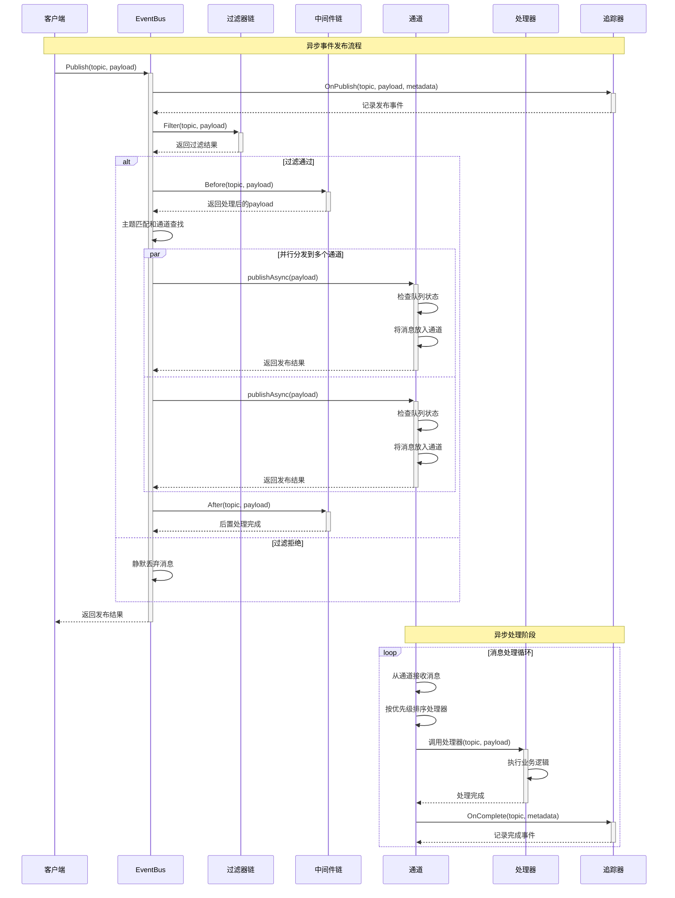

### 同步发布流程

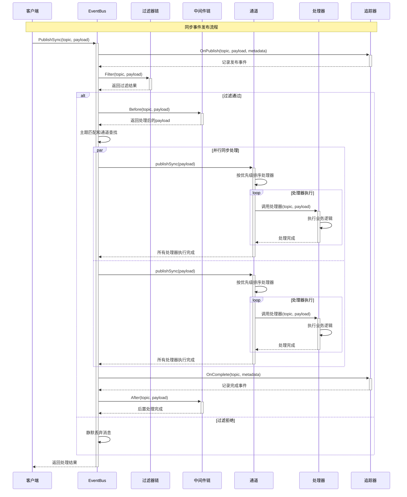

### 带上下文发布流程

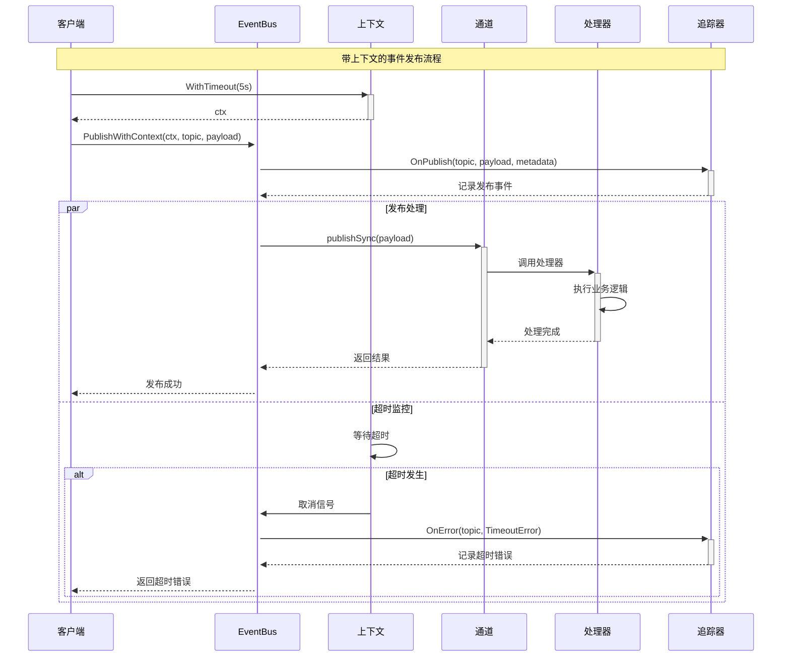

## 订阅管理时序图

### 订阅流程

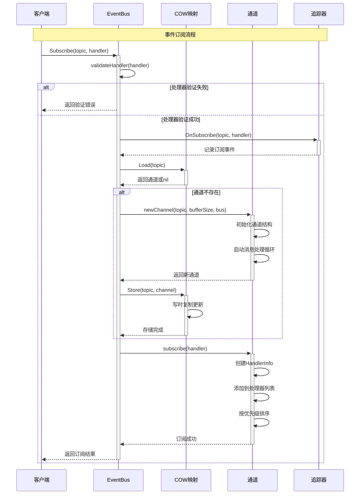

### 优先级订阅流程

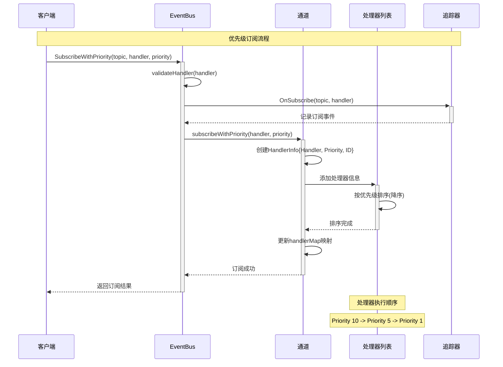

### 取消订阅流程

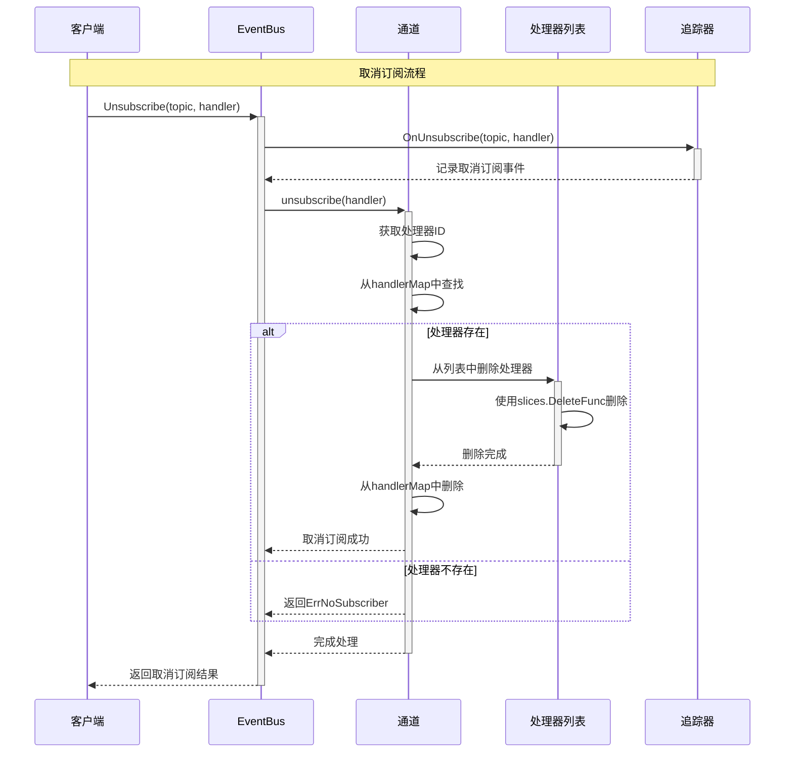

## 生命周期管理时序图

### EventBus启动流程

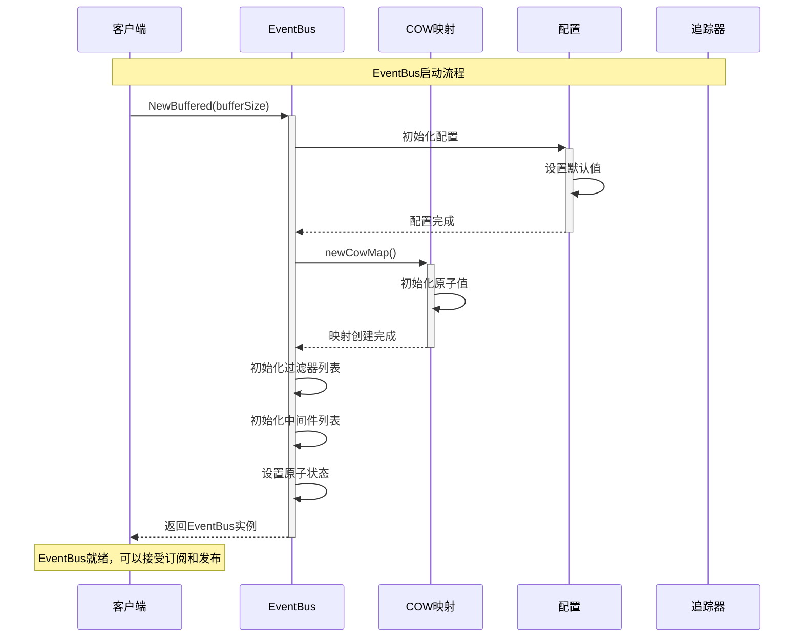

### EventBus关闭流程

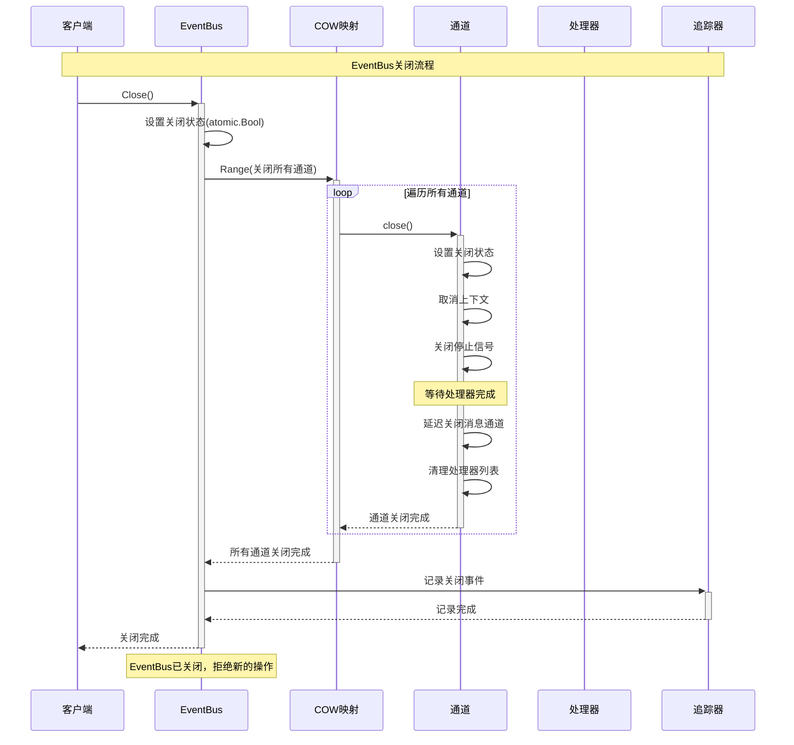

## 错误处理时序图

### 处理器异常处理

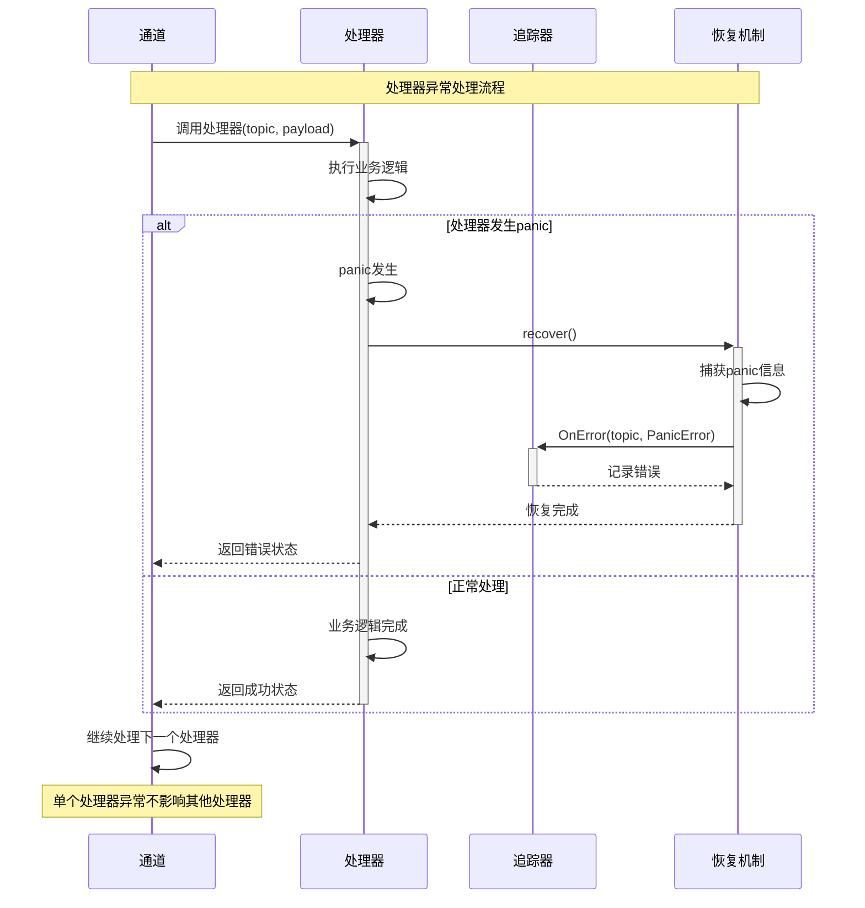

### 超时处理流程

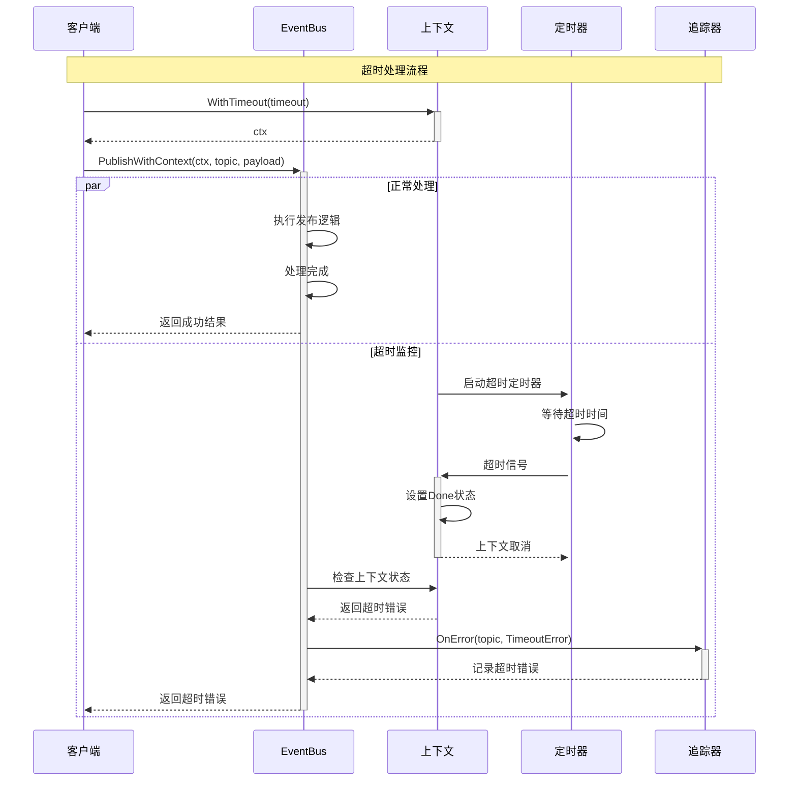

## 性能监控时序图

### 性能指标收集

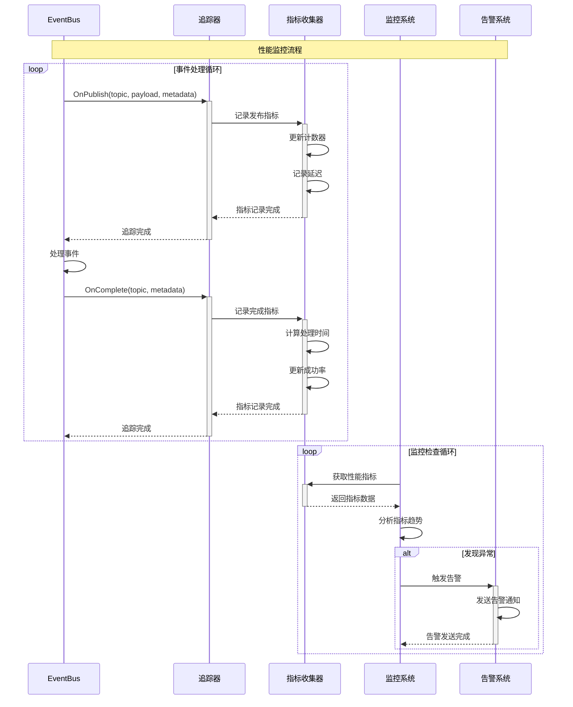

### 慢消费者检测

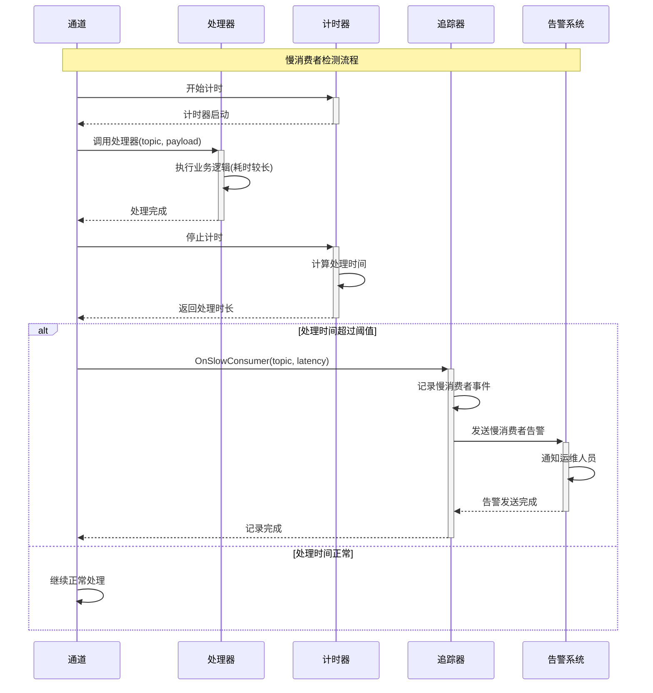