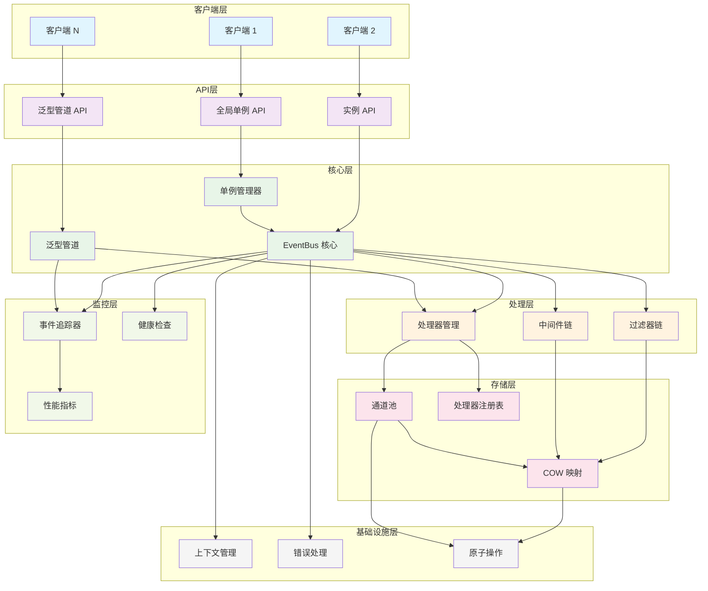
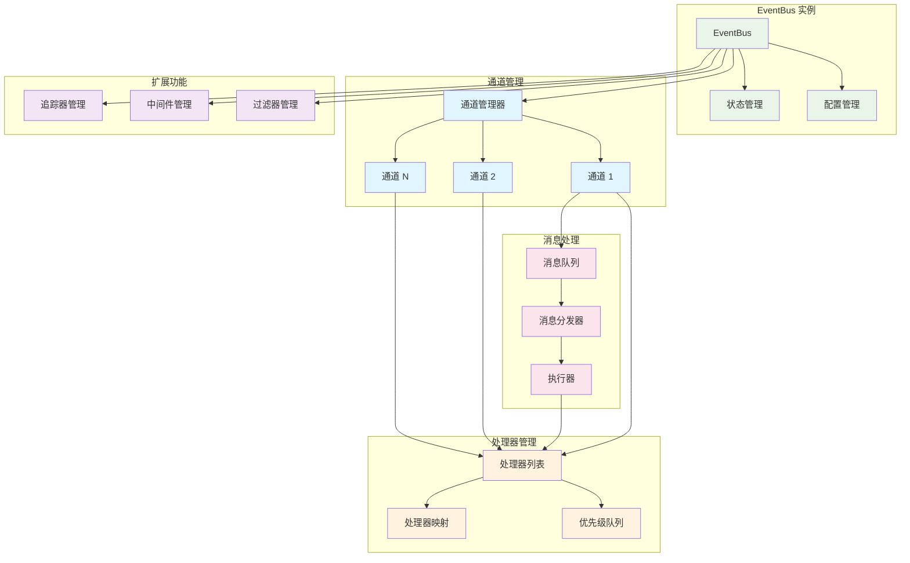
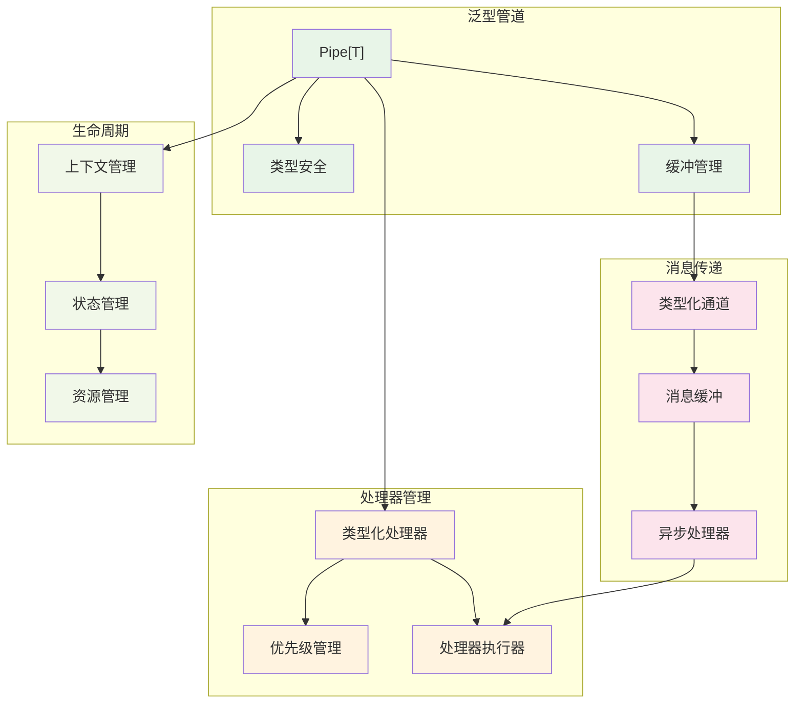
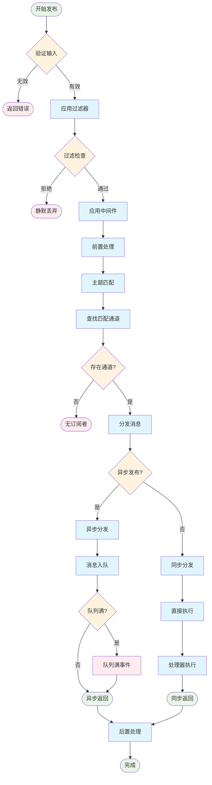
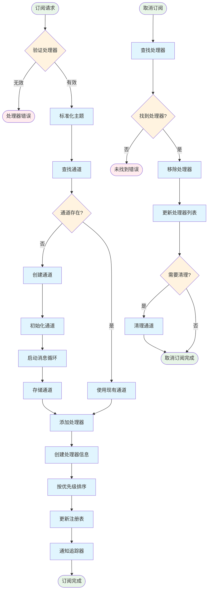
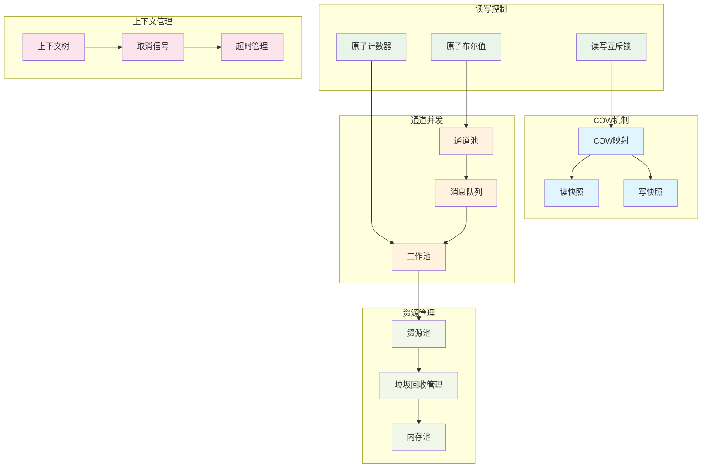
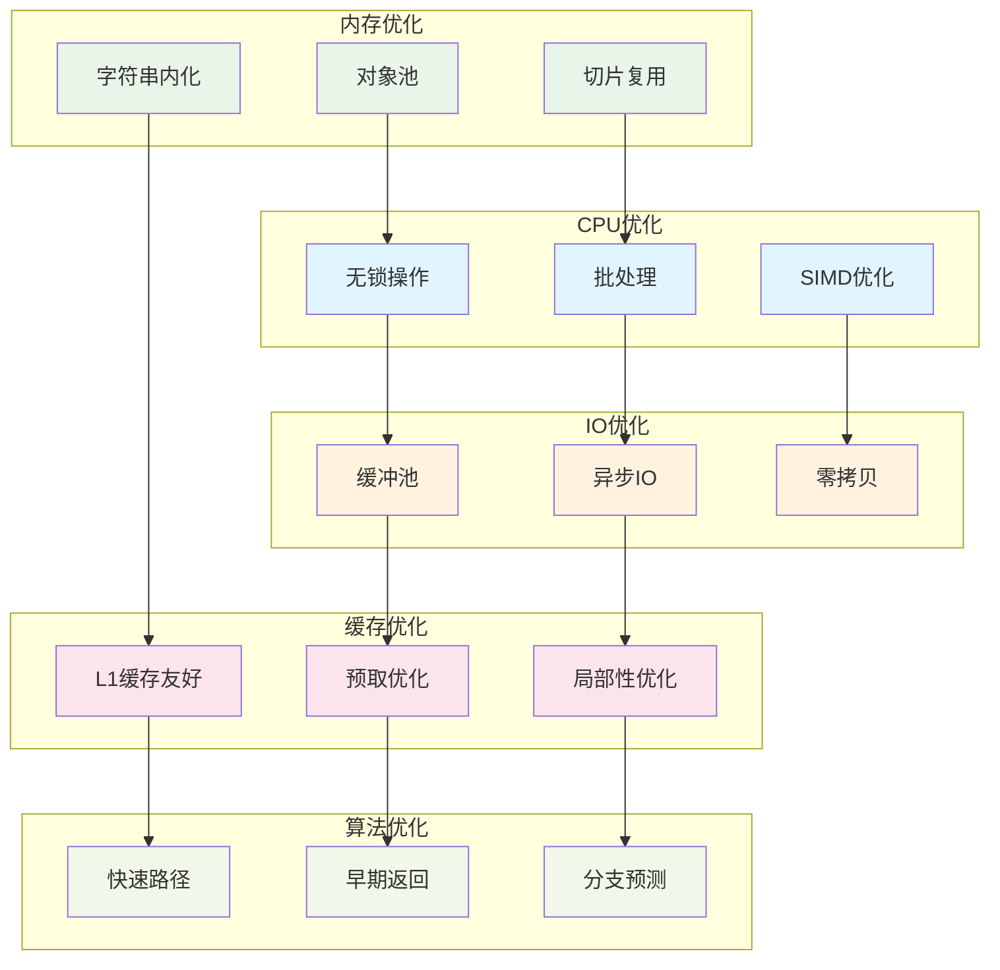
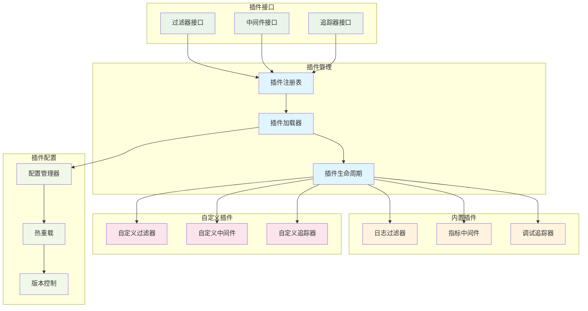
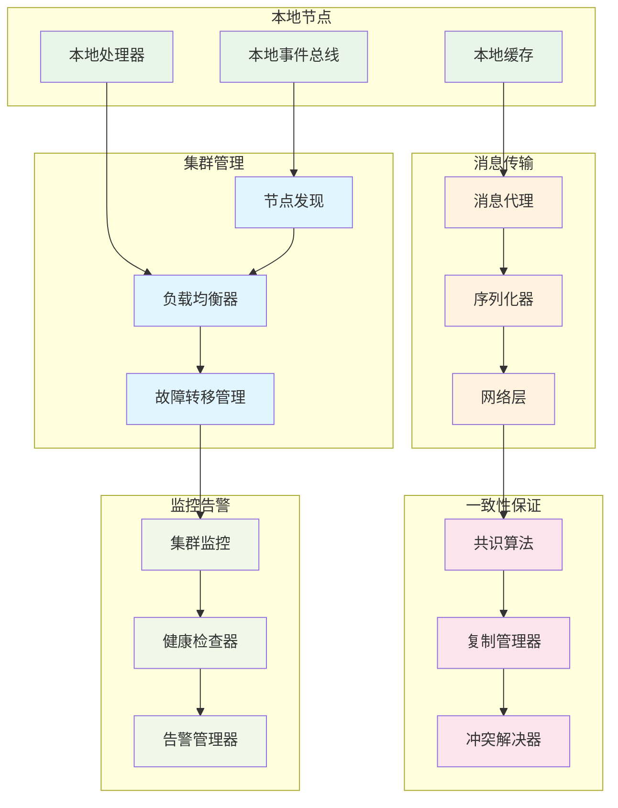

# EventBus 系统架构图

## 整体架构图

```mermaid
graph TB
    subgraph "客户端层"
        Client1["客户端 1"]
        Client2["客户端 2"]
        ClientN["客户端 N"]
    end
    
    subgraph "API层"
        GlobalAPI["全局单例 API"]
        InstanceAPI["实例 API"]
        PipeAPI["泛型管道 API"]
    end
    
    subgraph "核心层"
        EventBus["EventBus 核心"]
        Pipe["泛型管道"]
        Singleton["单例管理器"]
    end
    
    subgraph "处理层"
        FilterChain["过滤器链"]
        MiddlewareChain["中间件链"]
        HandlerManager["处理器管理"]
    end
    
    subgraph "存储层"
        COWMap["COW 映射"]
        ChannelPool["通道池"]
        HandlerRegistry["处理器注册表"]
    end
    
    subgraph "监控层"
        Tracer["事件追踪器"]
        Metrics["性能指标"]
        HealthCheck["健康检查"]
    end
    
    subgraph "基础设施层"
        Context["上下文管理"]
        ErrorHandler["错误处理"]
        AtomicOps["原子操作"]
    end
    
    Client1 --> GlobalAPI
    Client2 --> InstanceAPI
    ClientN --> PipeAPI
    
    GlobalAPI --> Singleton
    InstanceAPI --> EventBus
    PipeAPI --> Pipe
    
    Singleton --> EventBus
    EventBus --> FilterChain
    EventBus --> MiddlewareChain
    EventBus --> HandlerManager
    
    Pipe --> HandlerManager
    
    FilterChain --> COWMap
    MiddlewareChain --> COWMap
    HandlerManager --> ChannelPool
    HandlerManager --> HandlerRegistry
    
    ChannelPool --> COWMap
    
    EventBus --> Tracer
    Pipe --> Tracer
    Tracer --> Metrics
    EventBus --> HealthCheck
    
    EventBus --> Context
    EventBus --> ErrorHandler
    COWMap --> AtomicOps
    ChannelPool --> AtomicOps
    
    classDef clientLayer fill:#e1f5fe
    classDef apiLayer fill:#f3e5f5
    classDef coreLayer fill:#e8f5e8
    classDef processLayer fill:#fff3e0
    classDef storageLayer fill:#fce4ec
    classDef monitorLayer fill:#f1f8e9
    classDef infraLayer fill:#f5f5f5
    
    class Client1,Client2,ClientN clientLayer
    class GlobalAPI,InstanceAPI,PipeAPI apiLayer
    class EventBus,Pipe,Singleton coreLayer
    class FilterChain,MiddlewareChain,HandlerManager processLayer
    class COWMap,ChannelPool,HandlerRegistry storageLayer
    class Tracer,Metrics,HealthCheck monitorLayer
    class Context,ErrorHandler,AtomicOps infraLayer
```

## 核心组件架构

### EventBus 核心架构

```mermaid
graph TB
    subgraph "EventBus 实例"
        EB["EventBus"]
        Config["配置管理"]
        State["状态管理"]
    end
    
    subgraph "通道管理"
        ChannelMgr["通道管理器"]
        Channel1["通道 1"]
        Channel2["通道 2"]
        ChannelN["通道 N"]
    end
    
    subgraph "处理器管理"
        HandlerList["处理器列表"]
        PriorityQueue["优先级队列"]
        HandlerMap["处理器映射"]
    end
    
    subgraph "消息处理"
        MsgQueue["消息队列"]
        Dispatcher["消息分发器"]
        Executor["执行器"]
    end
    
    subgraph "扩展功能"
        FilterMgr["过滤器管理"]
        MiddlewareMgr["中间件管理"]
        TracerMgr["追踪器管理"]
    end
    
    EB --> Config
    EB --> State
    EB --> ChannelMgr
    EB --> FilterMgr
    EB --> MiddlewareMgr
    EB --> TracerMgr
    
    ChannelMgr --> Channel1
    ChannelMgr --> Channel2
    ChannelMgr --> ChannelN
    
    Channel1 --> HandlerList
    Channel1 --> MsgQueue
    Channel2 --> HandlerList
    ChannelN --> HandlerList
    
    HandlerList --> PriorityQueue
    HandlerList --> HandlerMap
    
    MsgQueue --> Dispatcher
    Dispatcher --> Executor
    Executor --> HandlerList
    
    classDef coreComp fill:#e8f5e8
    classDef channelComp fill:#e1f5fe
    classDef handlerComp fill:#fff3e0
    classDef msgComp fill:#fce4ec
    classDef extComp fill:#f3e5f5
    
    class EB,Config,State coreComp
    class ChannelMgr,Channel1,Channel2,ChannelN channelComp
    class HandlerList,PriorityQueue,HandlerMap handlerComp
    class MsgQueue,Dispatcher,Executor msgComp
    class FilterMgr,MiddlewareMgr,TracerMgr extComp
```

### 泛型管道架构

```mermaid
graph TB
    subgraph "泛型管道"
        Pipe["Pipe[T]"]
        TypeSafety["类型安全"]
        BufferMgr["缓冲管理"]
    end
    
    subgraph "处理器管理"
        TypedHandlers["类型化处理器"]
        PriorityMgr["优先级管理"]
        HandlerExec["处理器执行器"]
    end
    
    subgraph "消息传递"
        TypedChannel["类型化通道"]
        MsgBuffer["消息缓冲"]
        AsyncProcessor["异步处理器"]
    end
    
    subgraph "生命周期"
        ContextMgr["上下文管理"]
        StateMgr["状态管理"]
        ResourceMgr["资源管理"]
    end
    
    Pipe --> TypeSafety
    Pipe --> BufferMgr
    Pipe --> TypedHandlers
    Pipe --> ContextMgr
    
    TypedHandlers --> PriorityMgr
    TypedHandlers --> HandlerExec
    
    BufferMgr --> TypedChannel
    TypedChannel --> MsgBuffer
    MsgBuffer --> AsyncProcessor
    
    AsyncProcessor --> HandlerExec
    
    ContextMgr --> StateMgr
    StateMgr --> ResourceMgr
    
    classDef pipeComp fill:#e8f5e8
    classDef handlerComp fill:#fff3e0
    classDef msgComp fill:#fce4ec
    classDef lifecycleComp fill:#f1f8e9
    
    class Pipe,TypeSafety,BufferMgr pipeComp
    class TypedHandlers,PriorityMgr,HandlerExec handlerComp
    class TypedChannel,MsgBuffer,AsyncProcessor msgComp
    class ContextMgr,StateMgr,ResourceMgr lifecycleComp
```

## 数据流架构

### 事件发布数据流

```mermaid
flowchart TD
    Start([开始发布]) --> ValidateInput{验证输入}
    ValidateInput -->|无效| ReturnError([返回错误])
    ValidateInput -->|有效| ApplyFilters[应用过滤器]
    
    ApplyFilters --> FilterCheck{过滤检查}
    FilterCheck -->|拒绝| SilentDrop([静默丢弃])
    FilterCheck -->|通过| ApplyMiddleware[应用中间件]
    
    ApplyMiddleware --> BeforeProcess[前置处理]
    BeforeProcess --> TopicMatch[主题匹配]
    
    TopicMatch --> FindChannels[查找匹配通道]
    FindChannels --> HasChannels{存在通道?}
    HasChannels -->|否| NoSubscriber([无订阅者])
    HasChannels -->|是| DispatchMsg[分发消息]
    
    DispatchMsg --> AsyncCheck{异步发布?}
    AsyncCheck -->|是| AsyncDispatch[异步分发]
    AsyncCheck -->|否| SyncDispatch[同步分发]
    
    AsyncDispatch --> QueueMsg[消息入队]
    QueueMsg --> QueueFull{队列满?}
    QueueFull -->|是| QueueFullEvent[队列满事件]
    QueueFull -->|否| AsyncReturn([异步返回])
    
    SyncDispatch --> DirectExec[直接执行]
    DirectExec --> HandlerExec[处理器执行]
    HandlerExec --> SyncReturn([同步返回])
    
    QueueFullEvent --> AsyncReturn
    
    AsyncReturn --> AfterProcess[后置处理]
    SyncReturn --> AfterProcess
    AfterProcess --> Complete([完成])
    
    classDef startEnd fill:#e8f5e8
    classDef process fill:#e1f5fe
    classDef decision fill:#fff3e0
    classDef error fill:#ffebee
    
    class Start,Complete,AsyncReturn,SyncReturn startEnd
    class ApplyFilters,ApplyMiddleware,BeforeProcess,TopicMatch,FindChannels,DispatchMsg,AsyncDispatch,SyncDispatch,QueueMsg,DirectExec,HandlerExec,AfterProcess process
    class ValidateInput,FilterCheck,HasChannels,AsyncCheck,QueueFull decision
    class ReturnError,SilentDrop,NoSubscriber,QueueFullEvent error
```

### 订阅管理数据流

```mermaid
flowchart TD
    Subscribe([订阅请求]) --> ValidateHandler{验证处理器}
    ValidateHandler -->|无效| HandlerError([处理器错误])
    ValidateHandler -->|有效| NormalizeTopic[标准化主题]
    
    NormalizeTopic --> FindChannel[查找通道]
    FindChannel --> ChannelExists{通道存在?}
    ChannelExists -->|否| CreateChannel[创建通道]
    ChannelExists -->|是| UseExisting[使用现有通道]
    
    CreateChannel --> InitChannel[初始化通道]
    InitChannel --> StartLoop[启动消息循环]
    StartLoop --> StoreChannel[存储通道]
    StoreChannel --> AddHandler[添加处理器]
    
    UseExisting --> AddHandler
    AddHandler --> CreateHandlerInfo[创建处理器信息]
    CreateHandlerInfo --> SortByPriority[按优先级排序]
    SortByPriority --> UpdateRegistry[更新注册表]
    UpdateRegistry --> NotifyTracer[通知追踪器]
    NotifyTracer --> SubscribeComplete([订阅完成])
    
    Unsubscribe([取消订阅]) --> FindHandler[查找处理器]
    FindHandler --> HandlerFound{找到处理器?}
    HandlerFound -->|否| NotFoundError([未找到错误])
    HandlerFound -->|是| RemoveHandler[移除处理器]
    RemoveHandler --> UpdateList[更新处理器列表]
    UpdateList --> CleanupCheck{需要清理?}
    CleanupCheck -->|是| CleanupChannel[清理通道]
    CleanupCheck -->|否| UnsubscribeComplete([取消订阅完成])
    CleanupChannel --> UnsubscribeComplete
    
    classDef startEnd fill:#e8f5e8
    classDef process fill:#e1f5fe
    classDef decision fill:#fff3e0
    classDef error fill:#ffebee
    
    class Subscribe,SubscribeComplete,Unsubscribe,UnsubscribeComplete startEnd
    class NormalizeTopic,FindChannel,CreateChannel,InitChannel,StartLoop,StoreChannel,UseExisting,AddHandler,CreateHandlerInfo,SortByPriority,UpdateRegistry,NotifyTracer,FindHandler,RemoveHandler,UpdateList,CleanupChannel process
    class ValidateHandler,ChannelExists,HandlerFound,CleanupCheck decision
    class HandlerError,NotFoundError error
```

## 并发架构

### 并发控制架构

```mermaid
graph TB
    subgraph "读写控制"
        RWMutex["读写互斥锁"]
        AtomicBool["原子布尔值"]
        AtomicCounter["原子计数器"]
    end
    
    subgraph "COW机制"
        COWMap["COW映射"]
        ReadSnapshot["读快照"]
        WriteSnapshot["写快照"]
    end
    
    subgraph "通道并发"
        ChannelPool["通道池"]
        MsgQueue["消息队列"]
        WorkerPool["工作池"]
    end
    
    subgraph "上下文管理"
        ContextTree["上下文树"]
        CancelSignal["取消信号"]
        TimeoutMgr["超时管理"]
    end
    
    subgraph "资源管理"
        ResourcePool["资源池"]
        GCManager["垃圾回收管理"]
        MemoryPool["内存池"]
    end
    
    RWMutex --> COWMap
    AtomicBool --> ChannelPool
    AtomicCounter --> WorkerPool
    
    COWMap --> ReadSnapshot
    COWMap --> WriteSnapshot
    
    ChannelPool --> MsgQueue
    MsgQueue --> WorkerPool
    
    ContextTree --> CancelSignal
    CancelSignal --> TimeoutMgr
    
    WorkerPool --> ResourcePool
    ResourcePool --> GCManager
    GCManager --> MemoryPool
    
    classDef lockComp fill:#e8f5e8
    classDef cowComp fill:#e1f5fe
    classDef channelComp fill:#fff3e0
    classDef contextComp fill:#fce4ec
    classDef resourceComp fill:#f1f8e9
    
    class RWMutex,AtomicBool,AtomicCounter lockComp
    class COWMap,ReadSnapshot,WriteSnapshot cowComp
    class ChannelPool,MsgQueue,WorkerPool channelComp
    class ContextTree,CancelSignal,TimeoutMgr contextComp
    class ResourcePool,GCManager,MemoryPool resourceComp
```

### 性能优化架构

```mermaid
graph TB
    subgraph "内存优化"
        ObjectPool["对象池"]
        SliceReuse["切片复用"]
        StringIntern["字符串内化"]
    end
    
    subgraph "CPU优化"
        LockFree["无锁操作"]
        BatchProcess["批处理"]
        SIMD["SIMD优化"]
    end
    
    subgraph "IO优化"
        BufferPool["缓冲池"]
        AsyncIO["异步IO"]
        ZeroCopy["零拷贝"]
    end
    
    subgraph "缓存优化"
        L1Cache["L1缓存友好"]
        Prefetch["预取优化"]
        LocalityOpt["局部性优化"]
    end
    
    subgraph "算法优化"
        FastPath["快速路径"]
        EarlyReturn["早期返回"]
        BranchPredict["分支预测"]
    end
    
    ObjectPool --> LockFree
    SliceReuse --> BatchProcess
    StringIntern --> L1Cache
    
    LockFree --> BufferPool
    BatchProcess --> AsyncIO
    SIMD --> ZeroCopy
    
    BufferPool --> Prefetch
    AsyncIO --> LocalityOpt
    
    L1Cache --> FastPath
    Prefetch --> EarlyReturn
    LocalityOpt --> BranchPredict
    
    classDef memComp fill:#e8f5e8
    classDef cpuComp fill:#e1f5fe
    classDef ioComp fill:#fff3e0
    classDef cacheComp fill:#fce4ec
    classDef algoComp fill:#f1f8e9
    
    class ObjectPool,SliceReuse,StringIntern memComp
    class LockFree,BatchProcess,SIMD cpuComp
    class BufferPool,AsyncIO,ZeroCopy ioComp
    class L1Cache,Prefetch,LocalityOpt cacheComp
    class FastPath,EarlyReturn,BranchPredict algoComp
```

## 扩展架构

### 插件系统架构

```mermaid
graph TB
    subgraph "插件接口"
        FilterInterface["过滤器接口"]
        MiddlewareInterface["中间件接口"]
        TracerInterface["追踪器接口"]
    end
    
    subgraph "插件管理"
        PluginRegistry["插件注册表"]
        PluginLoader["插件加载器"]
        PluginLifecycle["插件生命周期"]
    end
    
    subgraph "内置插件"
        LogFilter["日志过滤器"]
        MetricsMiddleware["指标中间件"]
        DebugTracer["调试追踪器"]
    end
    
    subgraph "自定义插件"
        CustomFilter["自定义过滤器"]
        CustomMiddleware["自定义中间件"]
        CustomTracer["自定义追踪器"]
    end
    
    subgraph "插件配置"
        ConfigManager["配置管理器"]
        HotReload["热重载"]
        VersionControl["版本控制"]
    end
    
    FilterInterface --> PluginRegistry
    MiddlewareInterface --> PluginRegistry
    TracerInterface --> PluginRegistry
    
    PluginRegistry --> PluginLoader
    PluginLoader --> PluginLifecycle
    
    PluginLifecycle --> LogFilter
    PluginLifecycle --> MetricsMiddleware
    PluginLifecycle --> DebugTracer
    
    PluginLifecycle --> CustomFilter
    PluginLifecycle --> CustomMiddleware
    PluginLifecycle --> CustomTracer
    
    PluginLoader --> ConfigManager
    ConfigManager --> HotReload
    HotReload --> VersionControl
    
    classDef interfaceComp fill:#e8f5e8
    classDef mgmtComp fill:#e1f5fe
    classDef builtinComp fill:#fff3e0
    classDef customComp fill:#fce4ec
    classDef configComp fill:#f1f8e9
    
    class FilterInterface,MiddlewareInterface,TracerInterface interfaceComp
    class PluginRegistry,PluginLoader,PluginLifecycle mgmtComp
    class LogFilter,MetricsMiddleware,DebugTracer builtinComp
    class CustomFilter,CustomMiddleware,CustomTracer customComp
    class ConfigManager,HotReload,VersionControl configComp
```

### 分布式扩展架构（未来规划）

```mermaid
graph TB
    subgraph "本地节点"
        LocalEventBus["本地事件总线"]
        LocalHandlers["本地处理器"]
        LocalCache["本地缓存"]
    end
    
    subgraph "集群管理"
        NodeDiscovery["节点发现"]
        LoadBalancer["负载均衡器"]
        FailoverMgr["故障转移管理"]
    end
    
    subgraph "消息传输"
        MessageBroker["消息代理"]
        Serializer["序列化器"]
        NetworkLayer["网络层"]
    end
    
    subgraph "一致性保证"
        ConsensusAlgo["共识算法"]
        ReplicationMgr["复制管理器"]
        ConflictResolver["冲突解决器"]
    end
    
    subgraph "监控告警"
        ClusterMonitor["集群监控"]
        HealthChecker["健康检查器"]
        AlertManager["告警管理器"]
    end
    
    LocalEventBus --> NodeDiscovery
    LocalHandlers --> LoadBalancer
    LocalCache --> MessageBroker
    
    NodeDiscovery --> LoadBalancer
    LoadBalancer --> FailoverMgr
    
    MessageBroker --> Serializer
    Serializer --> NetworkLayer
    
    NetworkLayer --> ConsensusAlgo
    ConsensusAlgo --> ReplicationMgr
    ReplicationMgr --> ConflictResolver
    
    FailoverMgr --> ClusterMonitor
    ClusterMonitor --> HealthChecker
    HealthChecker --> AlertManager
    
    classDef localComp fill:#e8f5e8
    classDef clusterComp fill:#e1f5fe
    classDef msgComp fill:#fff3e0
    classDef consistencyComp fill:#fce4ec
    classDef monitorComp fill:#f1f8e9
    
    class LocalEventBus,LocalHandlers,LocalCache localComp
    class NodeDiscovery,LoadBalancer,FailoverMgr clusterComp
    class MessageBroker,Serializer,NetworkLayer msgComp
    class ConsensusAlgo,ReplicationMgr,ConflictResolver consistencyComp
    class ClusterMonitor,HealthChecker,AlertManager monitorComp
```