# EventBus 系统架构图

## 整体架构图

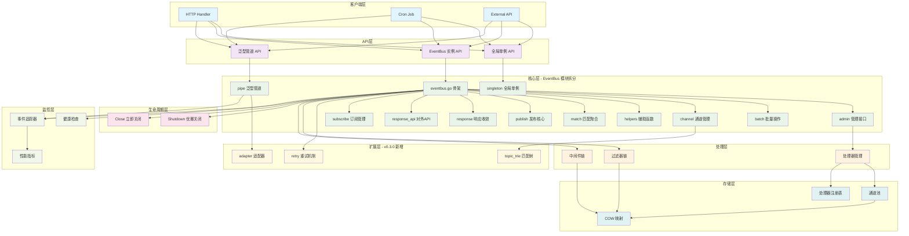

## 核心组件架构

### EventBus 核心架构

```mermaid
graph TB
    subgraph "EventBus 骨架"
        EB["eventbus.go"]
        Config["配置管理"]
        State["状态管理 (atomic)"]
    end
    
    subgraph "订阅管理"
        Sub["eventbus_subscribe.go"]
        SubOnce["SubscribeOnce 一次性订阅"]
        SubPriority["优先级订阅"]
        SubFilter["过滤器订阅"]
        SubReliable["SubscribeReliable 可靠订阅"]
    end
    
    subgraph "发布管理"
        Pub["eventbus_publish.go"]
        PubSync["PublishSync 同步"]
        PubAsync["Publish 异步"]
        PubCtx["PublishWithContext"]
        PubBatch["eventbus_batch.go"]
        PubMatch["eventbus_match.go"]
    end
    
    subgraph "响应式发布"
        Resp["eventbus_response.go"]
        RespAll["PublishSyncAll"]
        RespAny["PublishSyncAny"]
        RespValue["PublishSyncAnyValue"]
        RespAPI["eventbus_response_api.go"]
    end
    
    subgraph "通道与队列"
        Ch["eventbus_channel.go"]
        ChWorker["Worker 协程"]
        ChQueue["消息队列"]
        ChDeliver["投递与退订"]
    end
    
    subgraph "管理接口"
        Adm["eventbus_admin.go"]
        AdmClose["Close/Shutdown"]
        AdmStats["统计信息"]
        AdmHealth["健康检查"]
    end
    
    subgraph "辅助模块"
        Hlp["eventbus_helpers.go"]
        Err["errors.go"]
        Iface["interfaces.go"]
    end
    
    EB --> Config & State
    EB --> Sub & Pub & Resp & Ch & Adm & Hlp
    
    Sub --> SubOnce & SubPriority & SubFilter & SubReliable
    Pub --> PubSync & PubAsync & PubCtx
    Pub --> PubBatch & PubMatch
    Resp --> RespAll & RespAny & RespValue & RespAPI
    Ch --> ChWorker & ChQueue & ChDeliver
    Adm --> AdmClose & AdmStats & AdmHealth
    
    SubReliable --> Retry["retry.go 重试"]
    PubMatch --> Trie["topic_trie.go 匹配"]
    
    classDef skeleton fill:#e8f5e8
    classDef sub fill:#e1f5fe
    classDef pub fill:#fff3e0
    classDef resp fill:#f3e5f5
    classDef channel fill:#fce4ec
    classDef admin fill:#e0f2f1
    classDef helper fill:#f5f5f5
    
    class EB,Config,State skeleton
    class Sub,SubOnce,SubPriority,SubFilter,SubReliable sub
    class Pub,PubSync,PubAsync,PubCtx,PubBatch,PubMatch pub
    class Resp,RespAll,RespAny,RespValue,RespAPI resp
    class Ch,ChWorker,ChQueue,ChDeliver channel
    class Adm,AdmClose,AdmStats,AdmHealth admin
    class Hlp,Err,Iface,Retry,Trie helper
```

### 泛型管道架构

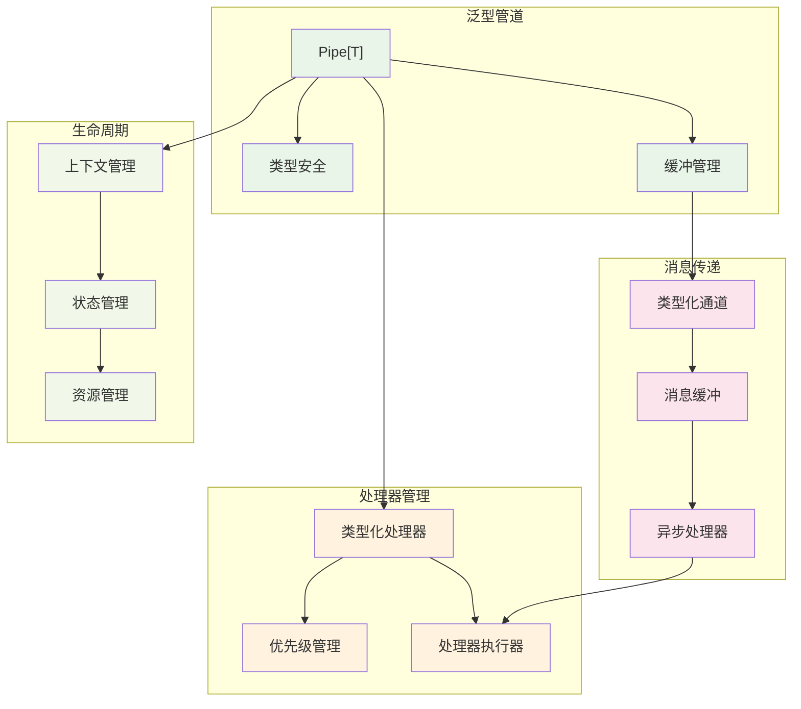

## Adapter 适配器架构

### 三层抽象模型

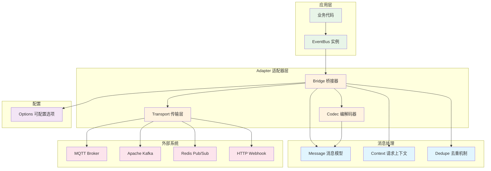

### 消息桥接流程

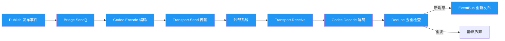

## 数据流架构

### 事件发布数据流

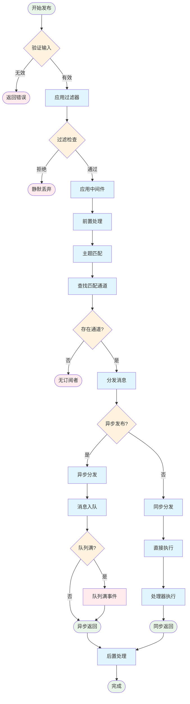

### 订阅管理数据流

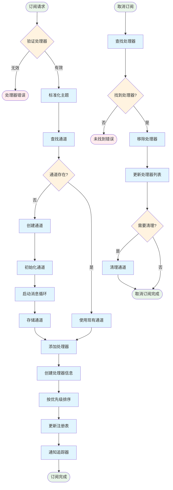

## 并发架构

### 并发控制架构

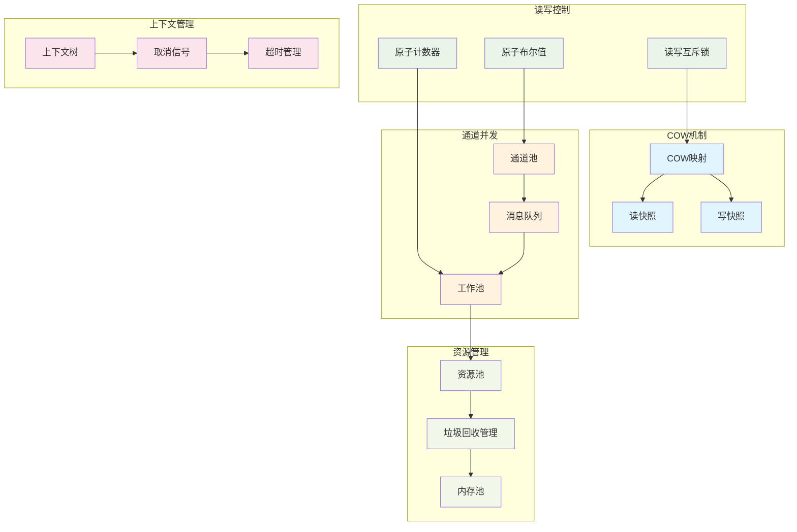

## EventBus 关闭与优雅关闭

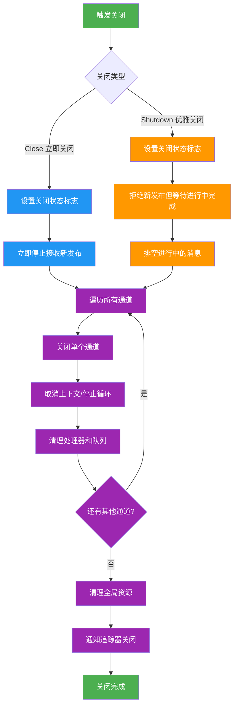

## 扩展架构

### 插件系统架构

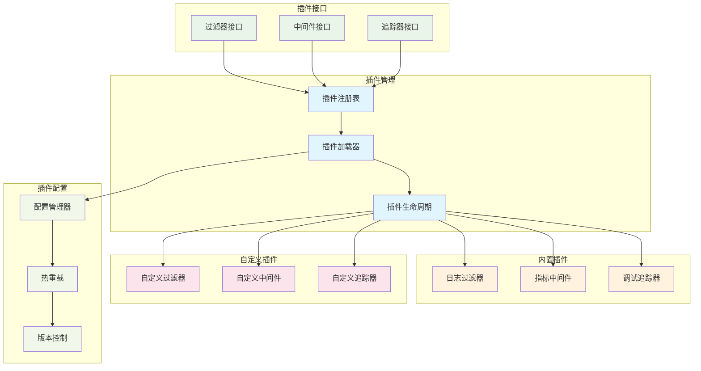

### 分布式扩展架构（未来规划）

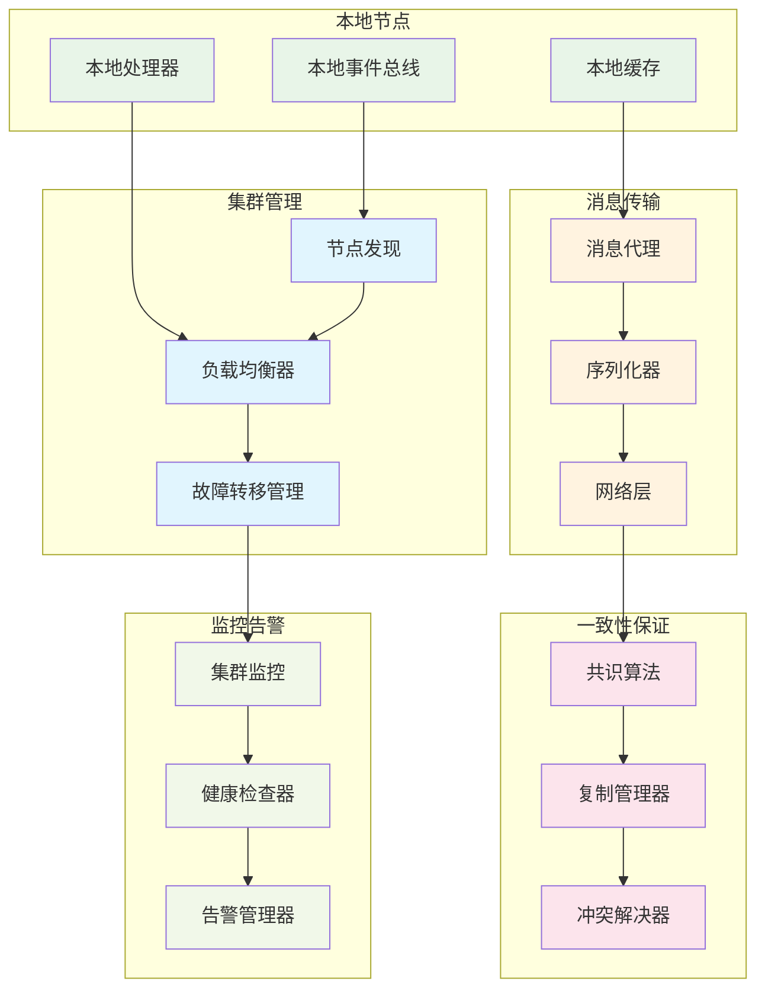