# EventBus 业务流程图

## 事件发布流程图

### 异步发布流程

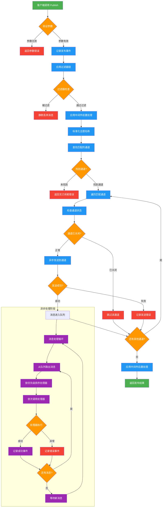

### 同步发布流程

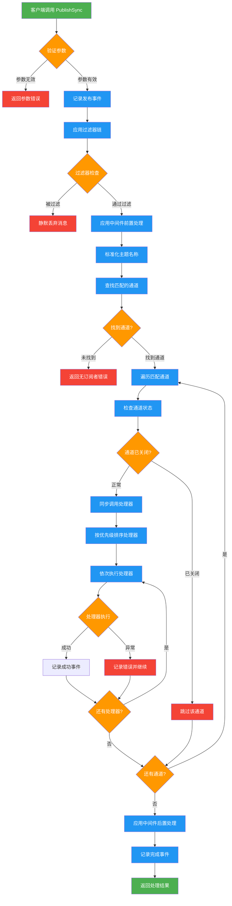

### 带上下文发布流程

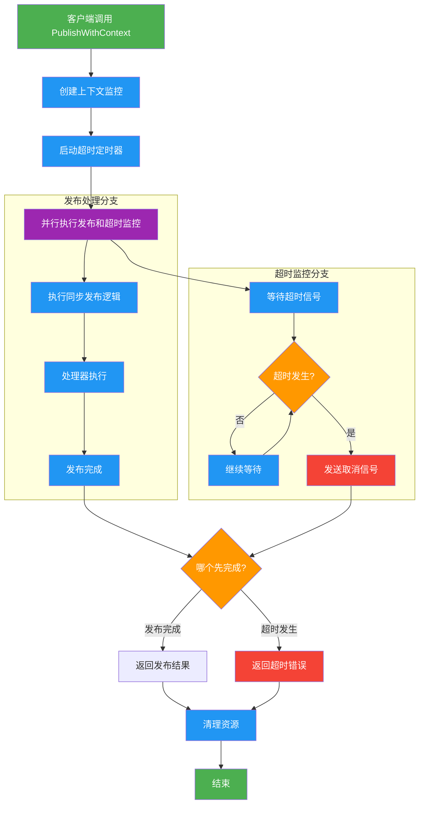

## 订阅管理流程图

### 订阅流程

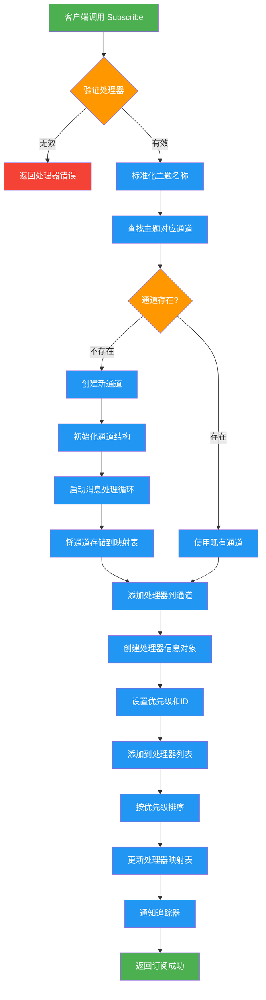

### 优先级订阅流程

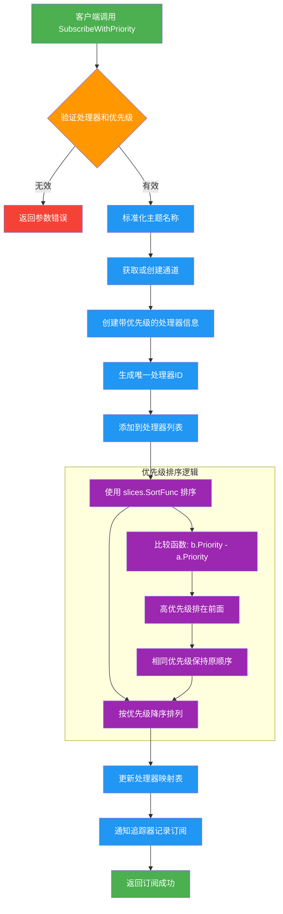

### 取消订阅流程

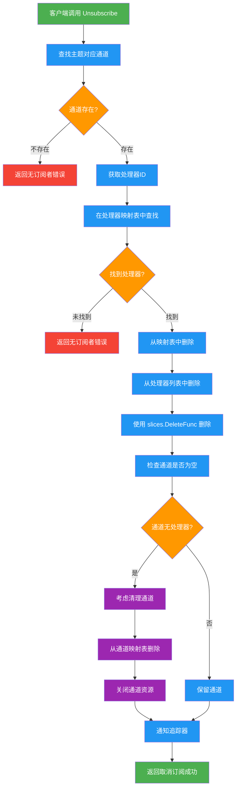

## 生命周期管理流程图

### EventBus 初始化流程

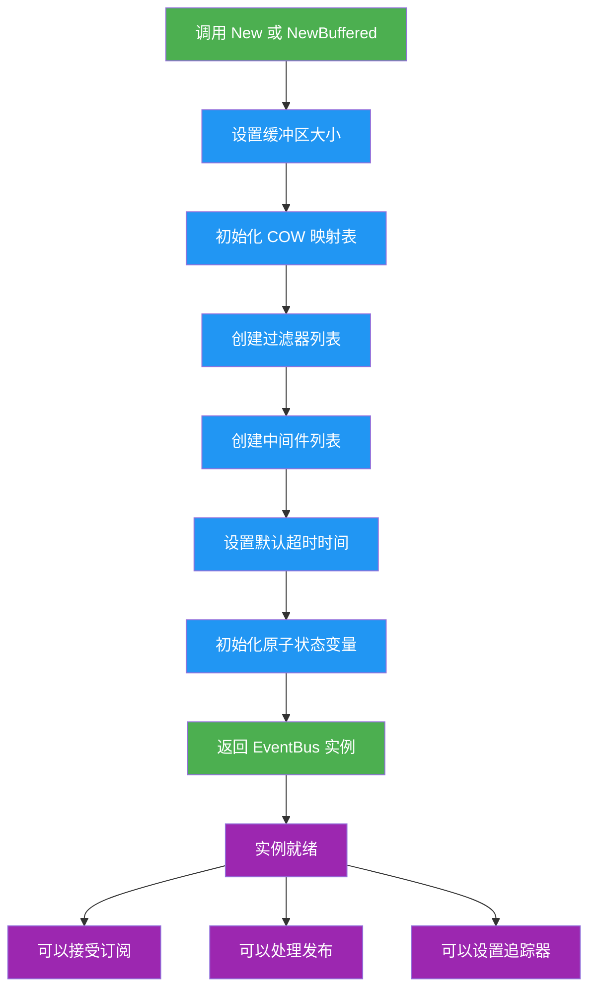

### EventBus 关闭流程

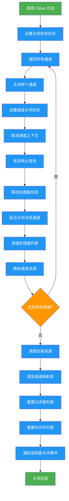

### 通道生命周期流程

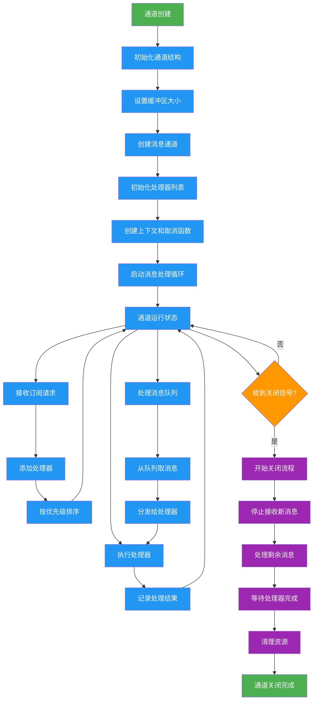

## 错误处理流程图

### 处理器异常处理流程

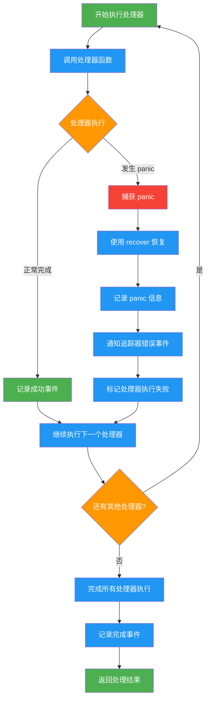

### 超时处理流程

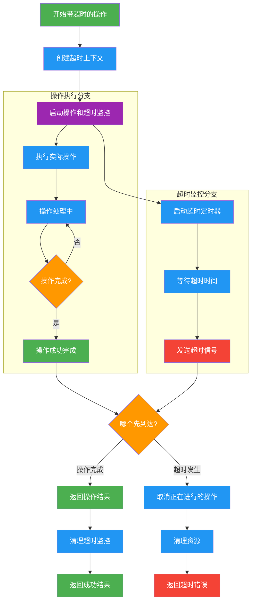

### 资源清理流程

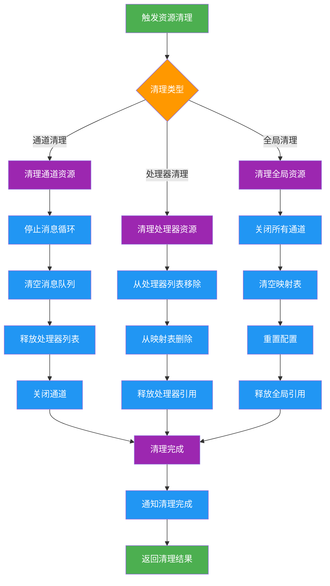
