# EventBus 业务流程图

## 事件发布流程图

### 异步发布流程

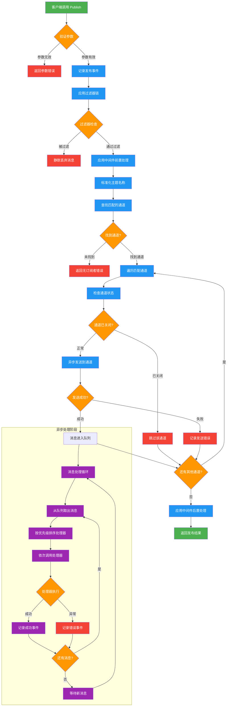
```mermaid
flowchart TD
    A[客户端调用 Publish] --> B{验证参数}
    B -->|参数无效| C[返回参数错误]
    B -->|参数有效| D[记录发布事件]
    
    D --> E[应用过滤器链]
    E --> F{过滤器检查}
    F -->|被过滤| G[静默丢弃消息]
    F -->|通过过滤| H[应用中间件前置处理]
    
    H --> I[标准化主题名称]
    I --> J[查找匹配的通道]
    J --> K{找到通道?}
    K -->|未找到| L[返回无订阅者错误]
    K -->|找到通道| M[遍历匹配通道]
    
    M --> N[检查通道状态]
    N --> O{通道已关闭?}
    O -->|已关闭| P[跳过该通道]
    O -->|正常| Q[异步发送到通道]
    
    Q --> R{发送成功?}
    R -->|失败| S[记录发送错误]
    R -->|成功| T[消息进入队列]
    
    P --> U{还有其他通道?}
    S --> U
    T --> U
    U -->|是| M
    U -->|否| V[应用中间件后置处理]
    
    V --> W[返回发布结果]
    
    subgraph "异步处理阶段"
        T --> X[消息处理循环]
        X --> Y[从队列取出消息]
        Y --> Z[按优先级排序处理器]
        Z --> AA[依次调用处理器]
        AA --> BB{处理器执行}
        BB -->|成功| CC[记录成功事件]
        BB -->|异常| DD[记录错误事件]
        CC --> EE{还有消息?}
        DD --> EE
        EE -->|是| Y
        EE -->|否| FF[等待新消息]
        FF --> X
    end
    
    classDef startEnd fill:#4CAF50,color:#fff
    classDef process fill:#2196F3,color:#fff
    classDef decision fill:#FF9800,color:#fff
    classDef error fill:#F44336,color:#fff
    classDef async fill:#9C27B0,color:#fff
    
    class A,W startEnd
    class D,E,H,I,J,M,N,Q,V process
    class B,F,K,O,R,U,BB,EE decision
    class C,G,L,P,S,DD error
    class X,Y,Z,AA,CC,FF async
```

### 同步发布流程

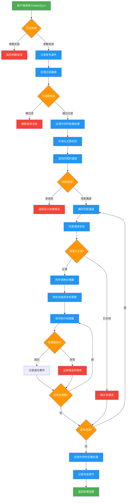
```mermaid
flowchart TD
    A[客户端调用 PublishSync] --> B{验证参数}
    B -->|参数无效| C[返回参数错误]
    B -->|参数有效| D[记录发布事件]
    
    D --> E[应用过滤器链]
    E --> F{过滤器检查}
    F -->|被过滤| G[静默丢弃消息]
    F -->|通过过滤| H[应用中间件前置处理]
    
    H --> I[标准化主题名称]
    I --> J[查找匹配的通道]
    J --> K{找到通道?}
    K -->|未找到| L[返回无订阅者错误]
    K -->|找到通道| M[遍历匹配通道]
    
    M --> N[检查通道状态]
    N --> O{通道已关闭?}
    O -->|已关闭| P[跳过该通道]
    O -->|正常| Q[同步调用处理器]
    
    Q --> R[按优先级排序处理器]
    R --> S[依次执行处理器]
    S --> T{处理器执行}
    T -->|成功| U[记录成功事件]
    T -->|异常| V[记录错误并继续]
    
    U --> W{还有处理器?}
    V --> W
    W -->|是| S
    W -->|否| X{还有通道?}
    
    P --> X
    X -->|是| M
    X -->|否| Y[应用中间件后置处理]
    
    Y --> Z[记录完成事件]
    Z --> AA[返回处理结果]
    
    classDef startEnd fill:#4CAF50,color:#fff
    classDef process fill:#2196F3,color:#fff
    classDef decision fill:#FF9800,color:#fff
    classDef error fill:#F44336,color:#fff
    
    class A,AA startEnd
    class D,E,H,I,J,M,N,Q,R,S,Y,Z process
    class B,F,K,O,T,W,X decision
    class C,G,L,P,V error
```

### 带上下文发布流程

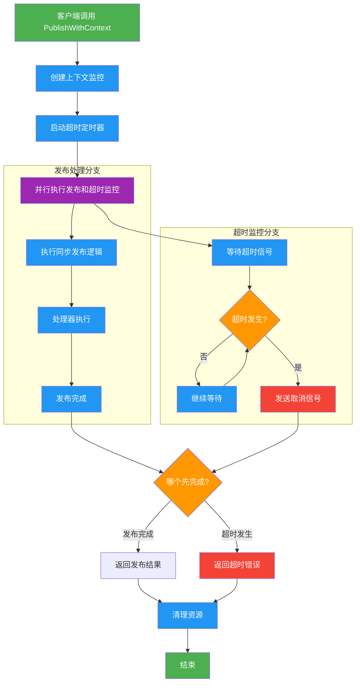
```mermaid
flowchart TD
    A[客户端调用 PublishWithContext] --> B[创建上下文监控]
    B --> C[启动超时定时器]
    C --> D[并行执行发布和超时监控]
    
    subgraph "发布处理分支"
        D --> E[执行同步发布逻辑]
        E --> F[处理器执行]
        F --> G[发布完成]
    end
    
    subgraph "超时监控分支"
        D --> H[等待超时信号]
        H --> I{超时发生?}
        I -->|否| J[继续等待]
        I -->|是| K[发送取消信号]
        J --> I
    end
    
    G --> L{哪个先完成?}
    K --> L
    L -->|发布完成| M[返回发布结果]
    L -->|超时发生| N[返回超时错误]
    
    M --> O[清理资源]
    N --> O
    O --> P[结束]
    
    classDef startEnd fill:#4CAF50,color:#fff
    classDef process fill:#2196F3,color:#fff
    classDef decision fill:#FF9800,color:#fff
    classDef error fill:#F44336,color:#fff
    classDef parallel fill:#9C27B0,color:#fff
    
    class A,P startEnd
    class B,C,E,F,G,H,J,O process
    class I,L decision
    class K,N error
    class D parallel
```

## 订阅管理流程图

### 订阅流程

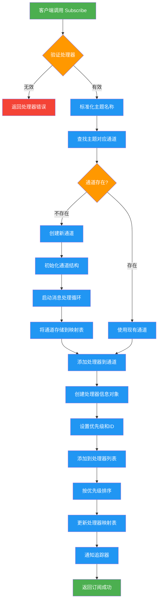
```mermaid
flowchart TD
    A[客户端调用 Subscribe] --> B{验证处理器}
    B -->|无效| C[返回处理器错误]
    B -->|有效| D[标准化主题名称]
    
    D --> E[查找主题对应通道]
    E --> F{通道存在?}
    F -->|不存在| G[创建新通道]
    F -->|存在| H[使用现有通道]
    
    G --> I[初始化通道结构]
    I --> J[启动消息处理循环]
    J --> K[将通道存储到映射表]
    K --> L[添加处理器到通道]
    
    H --> L
    L --> M[创建处理器信息对象]
    M --> N[设置优先级和ID]
    N --> O[添加到处理器列表]
    O --> P[按优先级排序]
    P --> Q[更新处理器映射表]
    Q --> R[通知追踪器]
    R --> S[返回订阅成功]
    
    classDef startEnd fill:#4CAF50,color:#fff
    classDef process fill:#2196F3,color:#fff
    classDef decision fill:#FF9800,color:#fff
    classDef error fill:#F44336,color:#fff
    
    class A,S startEnd
    class D,E,G,H,I,J,K,L,M,N,O,P,Q,R process
    class B,F decision
    class C error
```

### 优先级订阅流程

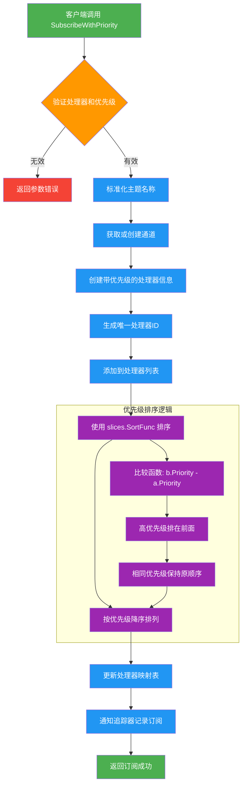
```mermaid
flowchart TD
    A[客户端调用 SubscribeWithPriority] --> B{验证处理器和优先级}
    B -->|无效| C[返回参数错误]
    B -->|有效| D[标准化主题名称]
    
    D --> E[获取或创建通道]
    E --> F[创建带优先级的处理器信息]
    F --> G[生成唯一处理器ID]
    G --> H[添加到处理器列表]
    
    H --> I[使用 slices.SortFunc 排序]
    I --> J[按优先级降序排列]
    J --> K[更新处理器映射表]
    K --> L[通知追踪器记录订阅]
    L --> M[返回订阅成功]
    
    subgraph "优先级排序逻辑"
        I --> N["比较函数: b.Priority - a.Priority"]
        N --> O[高优先级排在前面]
        O --> P[相同优先级保持原顺序]
        P --> J
    end
    
    classDef startEnd fill:#4CAF50,color:#fff
    classDef process fill:#2196F3,color:#fff
    classDef decision fill:#FF9800,color:#fff
    classDef error fill:#F44336,color:#fff
    classDef sort fill:#9C27B0,color:#fff
    
    class A,M startEnd
    class D,E,F,G,H,K,L process
    class B decision
    class C error
    class I,J,N,O,P sort
```

### 取消订阅流程

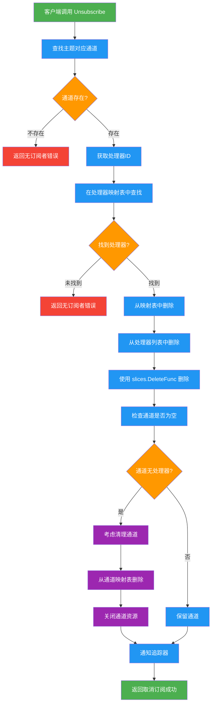
```mermaid
flowchart TD
    A[客户端调用 Unsubscribe] --> B[查找主题对应通道]
    B --> C{通道存在?}
    C -->|不存在| D[返回无订阅者错误]
    C -->|存在| E[获取处理器ID]
    
    E --> F[在处理器映射表中查找]
    F --> G{找到处理器?}
    G -->|未找到| H[返回无订阅者错误]
    G -->|找到| I[从映射表中删除]
    
    I --> J[从处理器列表中删除]
    J --> K[使用 slices.DeleteFunc 删除]
    K --> L[检查通道是否为空]
    L --> M{通道无处理器?}
    M -->|是| N[考虑清理通道]
    M -->|否| O[保留通道]
    
    N --> P[从通道映射表删除]
    P --> Q[关闭通道资源]
    Q --> R[通知追踪器]
    
    O --> R
    R --> S[返回取消订阅成功]
    
    classDef startEnd fill:#4CAF50,color:#fff
    classDef process fill:#2196F3,color:#fff
    classDef decision fill:#FF9800,color:#fff
    classDef error fill:#F44336,color:#fff
    classDef cleanup fill:#9C27B0,color:#fff
    
    class A,S startEnd
    class B,E,F,I,J,K,L,O,R process
    class C,G,M decision
    class D,H error
    class N,P,Q cleanup
```

## 生命周期管理流程图

### EventBus 初始化流程

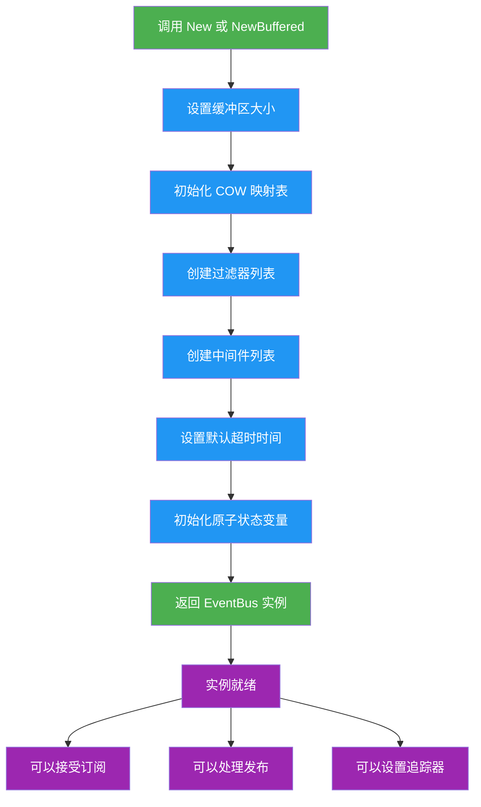
```mermaid
flowchart TD
    A[调用 New 或 NewBuffered] --> B[设置缓冲区大小]
    B --> C[初始化 COW 映射表]
    C --> D[创建过滤器列表]
    D --> E[创建中间件列表]
    E --> F[设置默认超时时间]
    F --> G[初始化原子状态变量]
    G --> H[返回 EventBus 实例]
    
    H --> I[实例就绪]
    I --> J[可以接受订阅]
    I --> K[可以处理发布]
    I --> L[可以设置追踪器]
    
    classDef startEnd fill:#4CAF50,color:#fff
    classDef process fill:#2196F3,color:#fff
    classDef ready fill:#9C27B0,color:#fff
    
    class A,H startEnd
    class B,C,D,E,F,G process
    class I,J,K,L ready
```

### EventBus 关闭流程

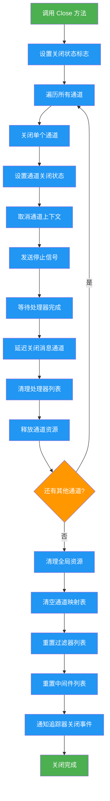
```mermaid
flowchart TD
    A[调用 Close 方法] --> B[设置关闭状态标志]
    B --> C[遍历所有通道]
    C --> D[关闭单个通道]
    
    D --> E[设置通道关闭状态]
    E --> F[取消通道上下文]
    F --> G[发送停止信号]
    G --> H[等待处理器完成]
    H --> I[延迟关闭消息通道]
    I --> J[清理处理器列表]
    J --> K[释放通道资源]
    
    K --> L{还有其他通道?}
    L -->|是| C
    L -->|否| M[清理全局资源]
    
    M --> N[清空通道映射表]
    N --> O[重置过滤器列表]
    O --> P[重置中间件列表]
    P --> Q[通知追踪器关闭事件]
    Q --> R[关闭完成]
    
    classDef startEnd fill:#4CAF50,color:#fff
    classDef process fill:#2196F3,color:#fff
    classDef decision fill:#FF9800,color:#fff
    classDef cleanup fill:#9C27B0,color:#fff
    
    class A,R startEnd
    class B,C,D,E,F,G,H,I,J,K,M,N,O,P,Q process
    class L decision
    class cleanup cleanup
```

### 通道生命周期流程

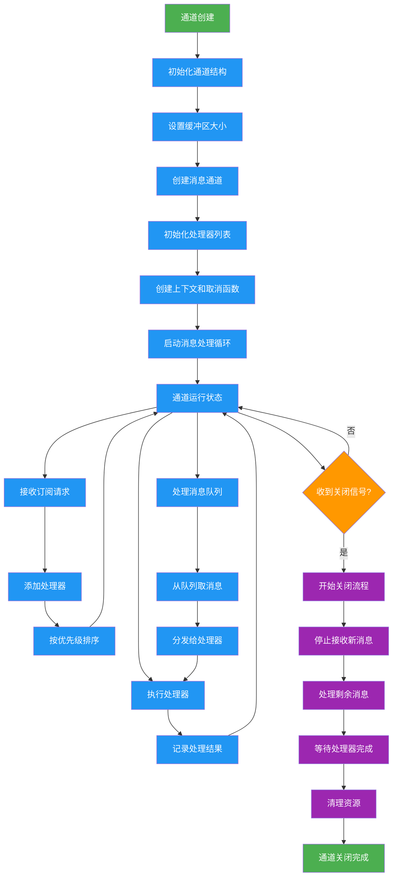
```mermaid
flowchart TD
    A[通道创建] --> B[初始化通道结构]
    B --> C[设置缓冲区大小]
    C --> D[创建消息通道]
    D --> E[初始化处理器列表]
    E --> F[创建上下文和取消函数]
    F --> G[启动消息处理循环]
    
    G --> H[通道运行状态]
    H --> I[接收订阅请求]
    H --> J[处理消息队列]
    H --> K[执行处理器]
    
    I --> L[添加处理器]
    L --> M[按优先级排序]
    M --> H
    
    J --> N[从队列取消息]
    N --> O[分发给处理器]
    O --> K
    K --> P[记录处理结果]
    P --> H
    
    H --> Q{收到关闭信号?}
    Q -->|否| H
    Q -->|是| R[开始关闭流程]
    
    R --> S[停止接收新消息]
    S --> T[处理剩余消息]
    T --> U[等待处理器完成]
    U --> V[清理资源]
    V --> W[通道关闭完成]
    
    classDef startEnd fill:#4CAF50,color:#fff
    classDef process fill:#2196F3,color:#fff
    classDef decision fill:#FF9800,color:#fff
    classDef running fill:#2196F3,color:#fff
    classDef shutdown fill:#9C27B0,color:#fff
    
    class A,W startEnd
    class B,C,D,E,F,G,I,J,K,L,M,N,O,P process
    class Q decision
    class H running
    class R,S,T,U,V shutdown
```

### 优雅关闭流程 (Shutdown)

```mermaid
flowchart TD
    A[调用 Shutdown] --> B[设置 shuttingDown 标志]
    B --> C[拒绝新的 Publish 请求]
    C --> D[等待进行中的发布完成]
    D --> E[遍历所有通道]
    
    E --> F[通知通道停止接收]
    F --> G[排空消息队列]
    G --> H[等待处理器自然完成]
    H --> I[取消上下文]
    I --> J[关闭消息通道]
    
    J --> K{通道全部处理完?}
    K -->|否| E
    K -->|是| L[清理全局资源]
    L --> M{超时?}
    M -->|是| N[强制关闭，返回 DeadlineExceeded]
    M -->|否| O[正常排空完成]
    
    N --> P[关闭完成]
    O --> P
    
    classDef start fill:#4CAF50,color:#fff
    classDef proc fill:#2196F3,color:#fff
    classDef drain fill:#FF9800,color:#fff
    classDef end fill:#9C27B0,color:#fff
    
    class A,P start
    class B,C,D,E,F,G,H,I,J,K,L proc
    class D drain
    class M,N,O end
```

> Shutdown 与 Close 的区别：Close 立即关闭不等处理中消息；Shutdown 等待已接收消息完成、排空队列后再关闭，适用于平滑发版/重启。

## 错误处理流程图

### 处理器异常处理流程

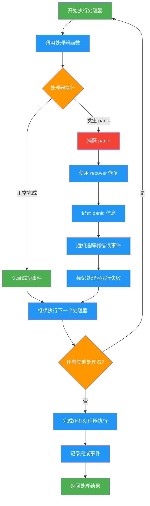
```mermaid
flowchart TD
    A[开始执行处理器] --> B[调用处理器函数]
    B --> C{处理器执行}
    C -->|正常完成| D[记录成功事件]
    C -->|发生 panic| E[捕获 panic]
    
    E --> F[使用 recover 恢复]
    F --> G[记录 panic 信息]
    G --> H[通知追踪器错误事件]
    H --> I[标记处理器执行失败]
    
    D --> J[继续执行下一个处理器]
    I --> J
    J --> K{还有其他处理器?}
    K -->|是| A
    K -->|否| L[完成所有处理器执行]
    
    L --> M[记录完成事件]
    M --> N[返回处理结果]
    
    classDef startEnd fill:#4CAF50,color:#fff
    classDef process fill:#2196F3,color:#fff
    classDef decision fill:#FF9800,color:#fff
    classDef error fill:#F44336,color:#fff
    classDef success fill:#4CAF50,color:#fff
    
    class A,N startEnd
    class B,F,G,H,I,J,L,M process
    class C,K decision
    class E error
    class D success
```

### 超时处理流程

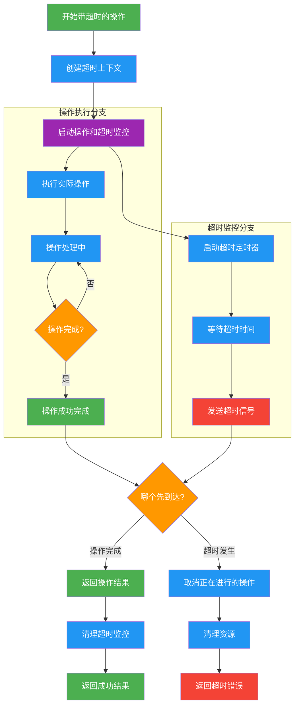
```mermaid
flowchart TD
    A[开始带超时的操作] --> B[创建超时上下文]
    B --> C[启动操作和超时监控]
    
    subgraph "操作执行分支"
        C --> D[执行实际操作]
        D --> E[操作处理中]
        E --> F{操作完成?}
        F -->|否| E
        F -->|是| G[操作成功完成]
    end
    
    subgraph "超时监控分支"
        C --> H[启动超时定时器]
        H --> I[等待超时时间]
        I --> J[发送超时信号]
    end
    
    G --> K{哪个先到达?}
    J --> K
    K -->|操作完成| L[返回操作结果]
    K -->|超时发生| M[取消正在进行的操作]
    
    M --> N[清理资源]
    N --> O[返回超时错误]
    
    L --> P[清理超时监控]
    P --> Q[返回成功结果]
    
    classDef startEnd fill:#4CAF50,color:#fff
    classDef process fill:#2196F3,color:#fff
    classDef decision fill:#FF9800,color:#fff
    classDef error fill:#F44336,color:#fff
    classDef success fill:#4CAF50,color:#fff
    classDef parallel fill:#9C27B0,color:#fff
    
    class A,Q startEnd
    class B,D,E,H,I,M,N,P process
    class F,K decision
    class J,O error
    class G,L success
    class C parallel
```

### 资源清理流程

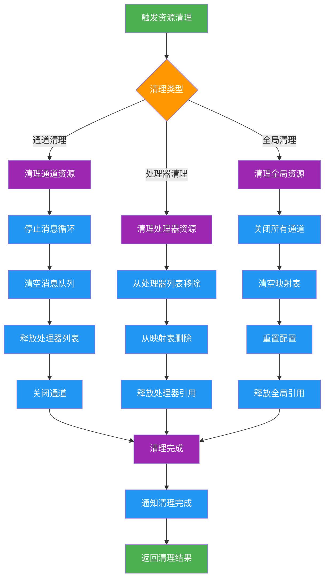
```mermaid
flowchart TD
    A[触发资源清理] --> B{清理类型}
    B -->|通道清理| C[清理通道资源]
    B -->|处理器清理| D[清理处理器资源]
    B -->|全局清理| E[清理全局资源]
    
    C --> F[停止消息循环]
    F --> G[清空消息队列]
    G --> H[释放处理器列表]
    H --> I[关闭通道]
    I --> J[清理完成]
    
    D --> K[从处理器列表移除]
    K --> L[从映射表删除]
    L --> M[释放处理器引用]
    M --> J
    
    E --> N[关闭所有通道]
    N --> O[清空映射表]
    O --> P[重置配置]
    P --> Q[释放全局引用]
    Q --> J
    
    J --> R[通知清理完成]
    R --> S[返回清理结果]
    
    classDef startEnd fill:#4CAF50,color:#fff
    classDef process fill:#2196F3,color:#fff
    classDef decision fill:#FF9800,color:#fff
    classDef cleanup fill:#9C27B0,color:#fff
    
    class A,S startEnd
    class F,G,H,I,K,L,M,N,O,P,Q,R process
    class B decision
    class C,D,E,J cleanup
```

## 重试机制流程图

### SubscribeReliable 可靠投递流程

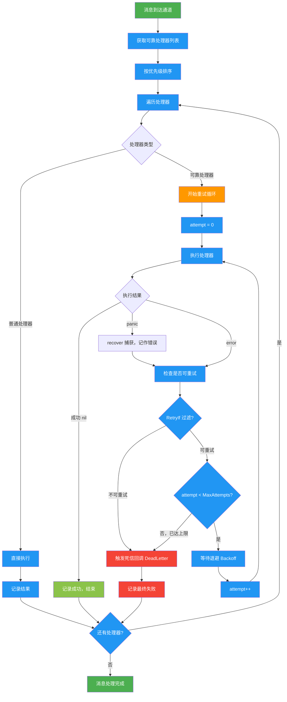
```mermaid
flowchart TD
    A[消息到达通道] --> B[获取可靠处理器列表]
    B --> C[按优先级排序]
    C --> D[遍历处理器]
    
    D --> E{处理器类型}
    E -->|普通处理器| F[直接执行]
    E -->|可靠处理器| G[开始重试循环]
    
    F --> H[记录结果]
    
    G --> I[attempt = 0]
    I --> J[执行处理器]
    J --> K{执行结果}
    
    K -->|成功 nil| L[记录成功，结束]
    K -->|panic| M[recover 捕获，记作错误]
    K -->|error| N[检查是否可重试]
    
    M --> N
    N --> O{RetryIf 过滤?}
    O -->|不可重试| P[触发死信回调 DeadLetter]
    O -->|可重试| Q{attempt < MaxAttempts?}
    
    Q -->|否，已达上限| P
    Q -->|是| R[等待退避 Backoff]
    R --> S[attempt++]
    S --> J
    
    P --> T[记录最终失败]
    
    L --> U{还有处理器?}
    H --> U
    T --> U
    U -->|是| D
    U -->|否| V[消息处理完成]
    
    classDef start fill:#4CAF50,color:#fff
    classDef proc fill:#2196F3,color:#fff
    classDef retry fill:#FF9800,color:#fff
    classDef dead fill:#F44336,color:#fff
    classDef ok fill:#8BC34A,color:#fff
    
    class A,V start
    class B,C,D,F,H,I,J,N,O,Q,R,S,U proc
    class G retry
    class K,M decision
    class P,T dead
    class L ok
```

### 退避策略类型

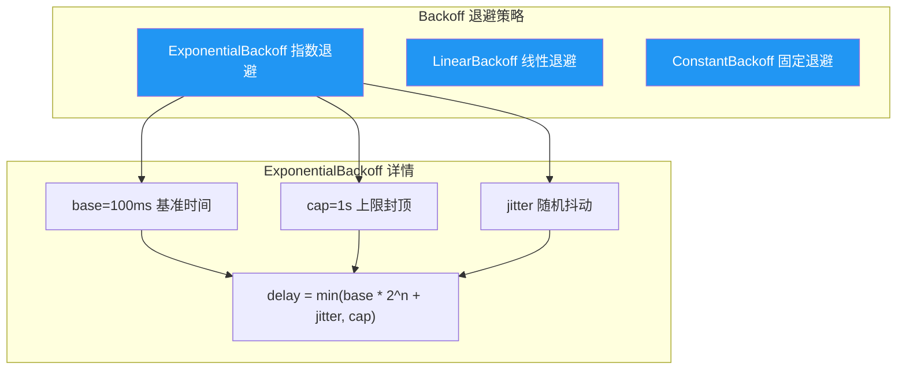
```mermaid
graph TB
    subgraph "Backoff 退避策略"
        Expo["ExponentialBackoff 指数退避"]
        Linear["LinearBackoff 线性退避"]
        Const["ConstantBackoff 固定退避"]
    end
    
    subgraph "ExponentialBackoff 详情"
        Base["base=100ms 基准时间"]
        Cap["cap=1s 上限封顶"]
        Jitter["jitter 随机抖动"]
        Calc["delay = min(base * 2^n + jitter, cap)"]
    end
    
    Expo --> Base & Cap & Jitter
    Base & Cap & Jitter --> Calc
    
    classDef strat fill:#2196F3,color:#fff
    class Expo,Linear,Const strat
    class Base,Cap,Jitter,Calc fill:#FF9800,color:#fff
```

> 退避期间全程尊重 context：超时/取消可中断退避等待。

## 适配器流程图

### Bridge 消息桥接流程

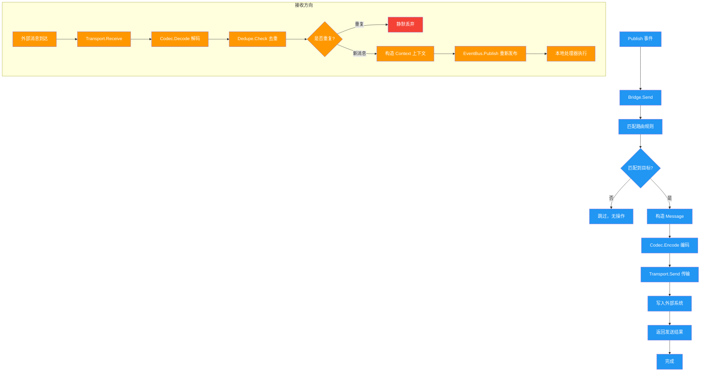
```mermaid
flowchart TD
    A[Publish 事件] --> B[Bridge.Send]
    B --> C[匹配路由规则]
    C --> D{匹配到目标?}
    D -->|否| E[跳过，无操作]
    D -->|是| F[构造 Message]
    
    F --> G[Codec.Encode 编码]
    G --> H[Transport.Send 传输]
    H --> I[写入外部系统]
    I --> J[返回发送结果]
    
    subgraph "接收方向"
        K[外部消息到达] --> L[Transport.Receive]
        L --> M[Codec.Decode 解码]
        M --> N[Dedupe.Check 去重]
        N --> O{是否重复?}
        O -->|重复| P[静默丢弃]
        O -->|新消息| Q[构造 Context 上下文]
        Q --> R[EventBus.Publish 重新发布]
        R --> S[本地处理器执行]
    end
    
    J --> T[完成]
    
    classDef send fill:#2196F3,color:#fff
    classDef recv fill:#FF9800,color:#fff
    classDef drop fill:#F44336,color:#fff
    
    class A,B,C,D,E,F,G,H,I,J,T send
    class K,L,M,N,O,Q,R,S recv
    class P drop
```

## TopicTrie 通配符匹配流程

### 基于 Trie 树的高效主题匹配

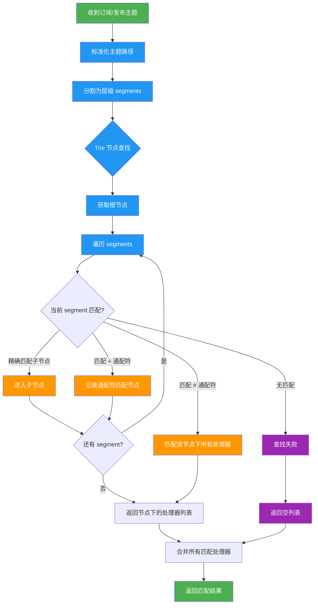
```mermaid
flowchart TD
    A[收到订阅/发布主题] --> B[标准化主题路径]
    B --> C[分割为层级 segments]
    C --> D{Trie 节点查找}
    
    D --> E[获取根节点]
    E --> F[遍历 segments]
    
    F --> G{当前 segment 匹配?}
    G -->|精确匹配子节点| H[进入子节点]
    G -->|匹配 + 通配符| I[记录通配符匹配节点]
    G -->|匹配 # 通配符| J[匹配该节点下所有处理器]
    G -->|无匹配| K[查找失败]
    
    H --> L{还有 segment?}
    L -->|是| F
    L -->|否| M[返回节点下的处理器列表]
    
    I --> L
    
    J --> M
    K --> N[返回空列表]
    
    M --> O[合并所有匹配处理器]
    N --> O
    O --> P[返回匹配结果]
    
    classDef start fill:#4CAF50,color:#fff
    classDef proc fill:#2196F3,color:#fff
    classDef match fill:#FF9800,color:#fff
    classDef wild fill:#9C27B0,color:#fff
    
    class A,P start
    class B,C,D,E,F proc
    class G,L,O decision
    class H,I,J match
    class K,N wild
```

> TopicTrie 支持 MQTT 标准通配符：`+` 匹配单层级、`#` 匹配零或多层级。时间复杂度 O(n)，n = Topic 层级深度。
> 并发安全：读操作无锁（atomic.Value 快照），写操作用 COW 策略。
