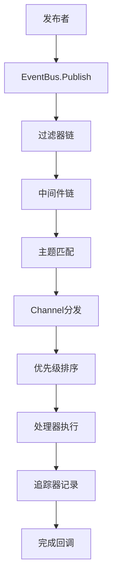

# EventBus 方案设计规则

## 设计哲学

### 1. 简洁优于复杂
- **最小化API表面**: 提供必要的功能，避免过度设计
- **合理的默认值**: 减少用户配置负担，提供开箱即用的体验
- **清晰的职责分离**: 每个组件有明确的职责边界
- **避免过早优化**: 先保证正确性，再考虑性能优化

### 2. 性能优于便利
- **零拷贝设计**: 尽可能避免不必要的数据拷贝
- **无锁编程**: 在可能的情况下使用原子操作替代锁
- **内存效率**: 优化内存使用，减少GC压力
- **批处理优化**: 支持批量操作以提高吞吐量

### 3. 安全优于速度
- **并发安全**: 所有公开API都必须是并发安全的
- **资源管理**: 确保资源的正确分配和释放
- **错误处理**: 完善的错误处理机制，避免panic
- **边界检查**: 对输入参数进行严格验证

### 4. 扩展优于修改
- **接口抽象**: 使用接口定义行为，支持不同实现
- **插件化设计**: 支持功能的插件化扩展
- **配置驱动**: 通过配置改变行为，而非修改代码
- **向后兼容**: 保持API的向后兼容性

## 架构设计原则

### 1. 分层架构
```
应用层 (Application Layer)
├── 全局单例接口
├── 便捷函数封装
└── 用户友好的API

核心层 (Core Layer)
├── EventBus 主要实现
├── Pipe 泛型管道
└── Channel 内部通道管理

基础层 (Foundation Layer)
├── COW Map 并发安全映射
├── 原子操作封装
└── 内存管理优化

扩展层 (Extension Layer)
├── Filter 过滤器系统
├── Middleware 中间件系统
├── Tracer 追踪系统
└── Transport 传输层（预留）
```

### 2. 组件职责划分

#### EventBus (事件总线核心)
**职责**:
- 管理主题和订阅者的映射关系
- 协调事件的发布和分发
- 提供生命周期管理功能
- 集成过滤器、中间件和追踪器

**设计约束**:
- 必须是并发安全的
- 支持优雅关闭
- 提供健康检查功能
- 支持统计信息收集

#### Channel (内部通道)
**职责**:
- 管理单个主题的订阅者列表
- 实现优先级处理机制
- 处理消息的异步分发
- 管理处理器的生命周期

**设计约束**:
- 支持优先级排序
- 防止内存泄漏
- 处理器异常不能影响其他处理器
- 支持优雅关闭

#### Pipe (泛型管道)
**职责**:
- 提供类型安全的消息传递
- 简化特定类型的事件处理
- 支持链式操作
- 提供函数式编程接口

**设计约束**:
- 编译时类型检查
- 运行时性能优化
- 支持流式处理
- 内存使用高效

### 3. 数据流设计



## 技术决策规则

### 1. 并发模型选择

#### Goroutine vs Thread Pool
**决策**: 使用Goroutine模型
**理由**:
- Go原生支持，轻量级
- 自动调度，无需手动管理
- 内存占用小，支持大量并发
- 与Go生态系统集成良好

#### Channel vs Mutex
**决策**: 优先使用Channel，必要时使用Mutex
**理由**:
- Channel符合Go的并发哲学
- 避免共享内存，减少竞态条件
- 提供更好的可组合性
- Mutex用于保护临界区资源

### 2. 内存管理策略

#### 对象池 vs 直接分配
**决策**: 对高频对象使用对象池
**理由**:
- 减少GC压力
- 提高内存分配效率
- 降低延迟抖动
- 适合高并发场景

#### 写时复制 vs 读写锁
**决策**: 读多写少场景使用写时复制
**理由**:
- 读操作无锁，性能更好
- 适合订阅者管理场景
- 减少锁竞争
- 提高并发度

### 3. 错误处理策略

#### Panic vs Error Return
**决策**: 优先返回Error，避免Panic
**理由**:
- 更好的错误控制
- 不会中断程序运行
- 便于错误处理和恢复
- 符合Go语言惯例

#### 错误传播 vs 错误吞噬
**决策**: 错误向上传播，关键错误记录日志
**理由**:
- 调用者可以决定如何处理错误
- 便于问题诊断和调试
- 提高系统的可观测性
- 避免静默失败

### 4. 性能优化策略

#### 预分配 vs 动态扩容
**决策**: 关键路径使用预分配
**理由**:
- 避免运行时内存分配
- 减少GC压力
- 提高性能可预测性
- 降低延迟

#### 批处理 vs 单个处理
**决策**: 支持批处理，默认单个处理
**理由**:
- 提高吞吐量
- 减少系统调用开销
- 保持API简洁性
- 用户可选择使用

## 扩展性设计规则

### 1. 接口设计原则

#### 接口隔离
```go
// 好的设计：职责单一的接口
type EventFilter interface {
    Filter(topic string, payload any) bool
}

type EventTracer interface {
    OnPublish(topic string, payload any, metadata PublishMetadata)
    OnError(topic string, err error)
}

// 避免：职责过多的接口
type EventProcessor interface {
    Filter(topic string, payload any) bool
    Process(topic string, payload any) error
    Trace(event Event)
    Validate(payload any) error
}
```

#### 依赖倒置
```go
// 好的设计：依赖抽象
type EventBus struct {
    tracer EventTracer  // 依赖接口
    filter EventFilter  // 依赖接口
}

// 避免：依赖具体实现
type EventBus struct {
    tracer *ConsoleTracer  // 依赖具体类型
    filter *TopicFilter    // 依赖具体类型
}
```

### 2. 插件化设计

#### 插件注册机制
```go
// 插件注册表
var pluginRegistry = make(map[string]PluginFactory)

// 插件工厂接口
type PluginFactory interface {
    Create(config map[string]interface{}) (Plugin, error)
    Name() string
    Version() string
}

// 插件注册函数
func RegisterPlugin(factory PluginFactory) {
    pluginRegistry[factory.Name()] = factory
}
```

#### 配置驱动的插件加载
```go
type PluginConfig struct {
    Name    string                 `json:"name"`
    Enabled bool                   `json:"enabled"`
    Config  map[string]interface{} `json:"config"`
}

func LoadPlugins(configs []PluginConfig) error {
    for _, cfg := range configs {
        if !cfg.Enabled {
            continue
        }
        
        factory, exists := pluginRegistry[cfg.Name]
        if !exists {
            return fmt.Errorf("插件不存在: %s", cfg.Name)
        }
        
        plugin, err := factory.Create(cfg.Config)
        if err != nil {
            return fmt.Errorf("创建插件失败: %v", err)
        }
        
        // 注册插件到系统
        registerPlugin(plugin)
    }
    return nil
}
```

### 3. 版本兼容性规则

#### API版本管理
```go
// 版本接口
type Versioned interface {
    Version() string
    CompatibleWith(version string) bool
}

// 版本检查
func CheckCompatibility(required, actual string) error {
    if !isCompatible(required, actual) {
        return fmt.Errorf("版本不兼容: 需要 %s, 实际 %s", required, actual)
    }
    return nil
}
```

#### 废弃API处理
```go
// 废弃标记
// Deprecated: 使用 PublishWithContext 替代
func (e *EventBus) PublishWithTimeout(topic string, payload any, timeout time.Duration) error {
    ctx, cancel := context.WithTimeout(context.Background(), timeout)
    defer cancel()
    return e.PublishWithContext(ctx, topic, payload)
}
```

## 质量保证规则

### 1. 测试策略

#### 测试金字塔
```
E2E测试 (5%)
├── 完整场景测试
└── 性能基准测试

集成测试 (15%)
├── 组件间交互测试
└── 并发安全测试

单元测试 (80%)
├── 功能正确性测试
├── 边界条件测试
└── 错误处理测试
```

#### 测试覆盖率要求
- 单元测试覆盖率 ≥ 80%
- 关键路径覆盖率 = 100%
- 错误处理覆盖率 ≥ 90%
- 并发测试覆盖率 ≥ 70%

### 2. 性能基准

#### 性能指标要求
```go
// 性能基准测试
func BenchmarkEventBusPublish(b *testing.B) {
    bus := NewBuffered(1024)
    bus.Subscribe("test", func(topic string, payload any) {})
    
    b.ResetTimer()
    b.RunParallel(func(pb *testing.PB) {
        for pb.Next() {
            bus.Publish("test", "payload")
        }
    })
}

// 性能要求
// - 单次发布延迟 < 1μs
// - 吞吐量 > 1M ops/sec
// - 内存分配 < 100B/op
// - GC暂停 < 1ms
```

#### 内存泄漏检测
```go
func TestMemoryLeak(t *testing.T) {
    runtime.GC()
    var m1 runtime.MemStats
    runtime.ReadMemStats(&m1)
    
    // 执行测试逻辑
    runTestScenario()
    
    runtime.GC()
    var m2 runtime.MemStats
    runtime.ReadMemStats(&m2)
    
    // 检查内存增长
    if m2.Alloc > m1.Alloc*2 {
        t.Errorf("可能存在内存泄漏: %d -> %d", m1.Alloc, m2.Alloc)
    }
}
```

### 3. 代码质量规则

#### 代码复杂度控制
- 圈复杂度 ≤ 10
- 函数长度 ≤ 50行
- 参数个数 ≤ 5个
- 嵌套层次 ≤ 4层

#### 命名规范
```go
// 好的命名
type EventBus struct{}          // 清晰的类型名
func (e *EventBus) Subscribe()  // 动词开头的方法名
var ErrChannelClosed = ...      // Err前缀的错误变量

// 避免的命名
type EB struct{}                // 缩写不清晰
func (e *EventBus) Sub()        // 方法名过于简短
var channelClosed = ...         // 错误变量命名不规范
```

#### 注释规范
```go
// EventBus 是一个高性能的事件总线实现
// 支持同步/异步事件发布、优先级订阅、事件过滤等功能
type EventBus struct {
    // bufferSize 指定内部通道的缓冲区大小
    // 0表示无缓冲，-1表示使用默认值
    bufferSize int
}

// Subscribe 订阅指定主题的事件
// topic: 事件主题，支持通配符 * 和 #
// handler: 事件处理器，必须是函数类型且有两个参数
// 返回错误如果处理器格式不正确或系统已关闭
func (e *EventBus) Subscribe(topic string, handler any) error {
    // 实现逻辑...
}
```

## 安全设计规则

### 1. 输入验证
```go
func validateHandler(handler any) error {
    if handler == nil {
        return ErrHandlerIsNil
    }
    
    handlerType := reflect.TypeOf(handler)
    if handlerType.Kind() != reflect.Func {
        return ErrHandlerIsNotFunc
    }
    
    if handlerType.NumIn() != 2 {
        return ErrHandlerParamNum
    }
    
    if handlerType.In(0) != reflect.TypeOf("") {
        return ErrHandlerFirstParam
    }
    
    return nil
}
```

### 2. 资源限制
```go
const (
    MaxSubscribers = 10000    // 最大订阅者数量
    MaxTopicLength = 256      // 最大主题长度
    MaxPayloadSize = 1024*1024 // 最大载荷大小
)

func (e *EventBus) Subscribe(topic string, handler any) error {
    if len(topic) > MaxTopicLength {
        return ErrTopicTooLong
    }
    
    if e.getSubscriberCount() >= MaxSubscribers {
        return ErrTooManySubscribers
    }
    
    // 继续处理...
}
```

### 3. 并发安全
```go
// 使用原子操作保证并发安全
type SafeCounter struct {
    value int64
}

func (c *SafeCounter) Add(delta int64) int64 {
    return atomic.AddInt64(&c.value, delta)
}

func (c *SafeCounter) Load() int64 {
    return atomic.LoadInt64(&c.value)
}
```

## 监控和可观测性规则

### 1. 指标收集
```go
type Metrics struct {
    PublishCount    *prometheus.CounterVec   // 发布计数
    SubscribeCount  *prometheus.GaugeVec     // 订阅计数
    ProcessLatency  *prometheus.HistogramVec // 处理延迟
    ErrorCount      *prometheus.CounterVec   // 错误计数
}

func (m *Metrics) RecordPublish(topic string, success bool) {
    labels := prometheus.Labels{"topic": topic, "success": strconv.FormatBool(success)}
    m.PublishCount.With(labels).Inc()
}
```

### 2. 日志记录
```go
// 结构化日志
func (e *EventBus) logEvent(level string, msg string, fields map[string]interface{}) {
    entry := log.WithFields(fields)
    switch level {
    case "info":
        entry.Info(msg)
    case "warn":
        entry.Warn(msg)
    case "error":
        entry.Error(msg)
    }
}

// 使用示例
e.logEvent("info", "事件发布成功", map[string]interface{}{
    "topic": topic,
    "subscribers": len(subscribers),
    "latency": latency.String(),
})
```

### 3. 健康检查
```go
func (e *EventBus) HealthCheck() error {
    if e.closed.Load() {
        return ErrEventBusClosed
    }
    
    // 检查关键组件状态
    if err := e.checkChannelHealth(); err != nil {
        return fmt.Errorf("通道健康检查失败: %w", err)
    }
    
    // 检查资源使用情况
    if err := e.checkResourceUsage(); err != nil {
        return fmt.Errorf("资源使用检查失败: %w", err)
    }
    
    return nil
}
```

这些设计规则确保了EventBus项目的高质量、高性能和可维护性，为项目的长期发展奠定了坚实的基础。