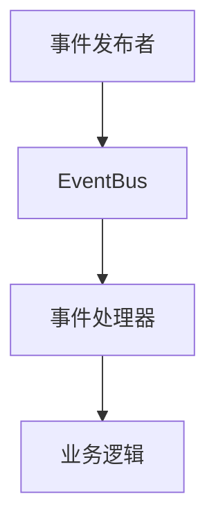

# EventBus 项目文档规范

## 文档编写原则

### 语言规范
- **主要语言**: 所有文档使用中文编写
- **技术术语**: 优先使用中文术语，必要时可在括号内标注英文
- **代码注释**: 代码中的注释必须使用中文
- **示例代码**: 变量名可使用英文，但注释说明必须是中文

### 文档结构
- **层次清晰**: 使用标准的Markdown标题层级
- **内容完整**: 每个文档都应包含完整的信息
- **逻辑连贯**: 内容组织要有逻辑性和连贯性
- **易于导航**: 提供清晰的目录和链接

## 文档分类和要求

### 1. 概述类文档
**文件**: `项目概述.md`
**内容要求**:
- 项目基本信息和目标
- 核心特性和技术架构
- 性能指标和应用场景
- 发展规划和社区支持

**格式要求**:
- 使用emoji图标增强可读性
- 包含性能数据和基准测试结果
- 提供清晰的技术架构说明

### 2. 设计类文档
**文件**: `API接口设计.md`, `方案设计规则.md`
**内容要求**:
- 详细的API接口说明
- 设计决策和技术选型理由
- 架构图和时序图说明
- 扩展性和兼容性考虑

**格式要求**:
- 使用Mermaid图表展示架构
- 提供完整的代码示例
- 包含错误处理和边界情况

### 3. 使用类文档
**文件**: `README.md`, 示例文档
**内容要求**:
- 快速开始指南
- 详细的使用示例
- 最佳实践和注意事项
- 常见问题和解决方案

**格式要求**:
- 代码示例要完整可运行
- 提供多种使用场景的示例
- 包含性能优化建议

### 4. 开发类文档
**文件**: `开发阶段规划.md`, `task-list.md`
**内容要求**:
- 开发计划和里程碑
- 任务分解和进度跟踪
- 测试策略和质量保证
- 发布流程和版本管理

## 图表文档规范

### Mermaid语法要求
```markdown
# 正确的写法


# 错误的写法（避免特殊字符）
```mermaid
graph TD
    A[事件发布者(Publisher)] --> B[EventBus]  # 避免括号
    B --> C{事件处理器}  # 避免花括号在标签中
```

### 图表类型和用途
1. **架构图**: 展示系统整体架构和组件关系
2. **时序图**: 展示事件处理的时间顺序
3. **流程图**: 展示业务流程和决策逻辑
4. **类图**: 展示代码结构和继承关系

### 图表文件组织
```
docs/images/
├── 架构图.md          # 系统架构图
├── 时序图.md          # 关键流程时序图
├── 流程图.md          # 业务流程图
└── 类图.md            # 代码结构图
```

## 代码示例规范

### 示例代码要求
1. **完整性**: 代码示例必须完整可运行
2. **实用性**: 展示真实的使用场景
3. **注释**: 关键代码必须有中文注释
4. **错误处理**: 包含适当的错误处理逻辑

### 示例格式
```go
// 创建事件总线实例
bus := eventbus.NewBuffered(1024)
defer bus.Close()

// 订阅用户创建事件
err := bus.Subscribe("user.created", func(topic string, payload any) {
    user := payload.(map[string]string)
    fmt.Printf("用户创建成功: %s\n", user["name"])
})
if err != nil {
    log.Printf("订阅失败: %v", err)
    return
}

// 发布用户创建事件
err = bus.Publish("user.created", map[string]string{
    "name": "张三",
    "email": "zhangsan@example.com",
})
if err != nil {
    log.Printf("发布失败: %v", err)
}
```

## 文档维护流程

### 更新触发条件
1. **代码变更**: API变更时必须同步更新文档
2. **功能新增**: 新功能开发完成后更新相关文档
3. **问题修复**: 修复问题后更新FAQ和注意事项
4. **性能优化**: 性能改进后更新基准测试数据

### 审查流程
1. **自审**: 作者完成文档后进行自我审查
2. **同行审查**: 其他开发者进行内容和技术审查
3. **用户反馈**: 收集用户反馈并持续改进
4. **定期更新**: 定期检查文档的准确性和时效性

### 版本管理
1. **版本标记**: 重要文档变更要标记版本号
2. **变更记录**: 维护文档变更历史记录
3. **向后兼容**: 保持文档的向后兼容性
4. **迁移指南**: 提供版本升级的迁移指南

## 质量标准

### 内容质量
- **准确性**: 信息必须准确无误
- **完整性**: 内容要完整覆盖相关主题
- **时效性**: 信息要保持最新状态
- **实用性**: 内容要对用户有实际帮助

### 格式质量
- **一致性**: 格式风格要保持一致
- **可读性**: 排版清晰，易于阅读
- **导航性**: 提供清晰的导航和链接
- **美观性**: 适当使用格式化和图标

### 技术质量
- **代码正确**: 示例代码要能正确运行
- **最佳实践**: 展示推荐的使用方式
- **性能考虑**: 包含性能相关的说明
- **安全性**: 考虑安全相关的注意事项

## 工具和资源

### 推荐工具
1. **Markdown编辑器**: Typora, Mark Text
2. **图表工具**: Mermaid Live Editor
3. **代码格式化**: gofmt, goimports
4. **文档生成**: godoc, pkgsite

### 参考资源
1. **Go官方文档**: https://golang.org/doc/
2. **Markdown规范**: CommonMark Spec
3. **Mermaid文档**: https://mermaid-js.github.io/
4. **技术写作指南**: Google Developer Documentation Style Guide

## 检查清单

### 文档发布前检查
- [ ] 内容准确性检查
- [ ] 代码示例测试
- [ ] 格式规范检查
- [ ] 链接有效性验证
- [ ] 图表显示正常
- [ ] 中文表达规范
- [ ] 版本信息更新

### 定期维护检查
- [ ] 内容时效性审查
- [ ] 用户反馈处理
- [ ] 性能数据更新
- [ ] 示例代码验证
- [ ] 外部链接检查
- [ ] 文档结构优化